New York Taxi Data
================

# Loading R libraries

The following R libraries have been used for the analysis.

``` r
knitr::opts_chunk$set(
    echo = TRUE,
    message = FALSE,
    warning = FALSE, 
    cache=TRUE, 
    autodep = TRUE, 
    screenshot.force = TRUE, 
    out.width="100%", 
    dpi=300,
    cache.lazy = FALSE
)
# Install CRAN packages
list.of.packages <- c(
  "data.table",
  "tidyverse",
  "lubridate",
  "plotly",
  "leaflet",
  "geosphere",
  "ggthemes",
  "ggcorrplot",
  "webshot",
  "caret",
  "xgboost",
  "car"
)

new.packages <- list.of.packages[!(list.of.packages %in% installed.packages()[, "Package"])]
if (length(new.packages)) install.packages(new.packages, repos = "https://cran.rstudio.com/", dependencies = T)

suppressWarnings(suppressMessages(suppressPackageStartupMessages({
  library(data.table)
  library(tidyverse)
  library(lubridate)
  library(plotly)
  library(leaflet)
  library(geosphere)
  library(ggthemes)
  library(ggcorrplot)
  library(webshot)
  library(caret)
  library(xgboost)
  library(car)
})))
```

# Preparing Data

## Load Datasets

The zipped files were downloaded manually from the link provided and
decompressed to extract the CSVs.  
The CSVs are loaded in to memory using the *fread* function from the
**data.table** package

``` r
trip_fare <- fread('../Data/trip_fare_3.csv')
trip_data <- fread('../Data/trip_data_3.csv')
```

## Merge two datasets

Let’s merge the two datasets to create a single dataset containing all
the information.  
Since the data does not comes with a data dictionary, we will try to
define the primary key for the two datasets. Ideally, a unique trip can
be identified by taxi identifier, with a given pick-up datetime.

  - medallion - unique taxi permit
  - hack\_license - unique taxi license number
  - vendor\_id - Taxi service provider company
  - pickup\_datetime - Adding in time component to uniquely identify a
    single trip

Based on the primary keys, we will identify if we have duplicates in the
two datasets before merging them.

``` r
join_keycols <- names(trip_fare)[1:4]
setkeyv(trip_fare, join_keycols)
setkeyv(trip_data, join_keycols)

# Number of records in trip fare dataset
trip_fare[, .N]
#15100468

# Unique records in trip fare dataset by the primary key
uniqueN(trip_fare, by = key(trip_fare))
#15099816

# Number of records in trip data dataset
trip_data[,.N]
#15100468

# Unique records in trip data dataset by the primary key
uniqueN(trip_data, by = key(trip_data))
#15099816
```

Looking at the statistics above and based on the defined primary key to
identify a unique trip, we do see some duplicates in both the datasets.
We need to ensure the duplicates are removed and both datasets contains
same trips before merging them.

``` r
trip_fare <- unique(trip_fare, by = key(trip_fare))
trip_data <- unique(trip_data, by = key(trip_data))

# Inner JOIN makes sure that we have only the common trips from both the datasets
trip_combined <- trip_fare[trip_data, nomatch = 0]
trip_combined[, .N]
#15099816
```

## Sample dataset

Since the dataset is large and resources are limited, we will work with
a sample of the data instead of the entire dataset. Here, we are taking
a random sample of 10% of the entire dataset. Seed is set before taking
the sample to make sure the results are reproducible everytime the code
is re-run. We will save the sample dataset to a file so that we don’t
have to repeat these steps everytime the code is re-run and instead read
the sample dataset directly from disk.

``` r
set.seed(131)

# Randomly select 10% of the records
trip_combined[, sample_flg := sample(c(TRUE, FALSE), size = .N, replace = TRUE, prob = c(0.1, 0.9))]

# Subset the 10% of the records as a sampe dataset
trip_combined_sample <- trip_combined[sample_flg == T]

# Save the contents to disk
fwrite(trip_combined_sample, '../Data/trip_combined_sample.csv')

# Compress the csv
system(sprintf("gzip -f ../Data/trip_combined_sample.csv"))
```

## Load the sample dataset

``` r
trip_combined_sample <- fread('../Data/trip_combined_sample.csv.gz')
```

# Exploratory Data Analysis

## Descriptive Statistics

Let’s look at the data type of the different variables we have in the
dataset.

``` r
glimpse(trip_combined_sample)
```

    ## Observations: 1,573,406
    ## Variables: 22
    ## $ medallion          <chr> "00005007A9F30E289E760362F69E4EAD", "00005007A9F30…
    ## $ hack_license       <chr> "16780B3E72BAA7A5C152C197919DCA0E", "16780B3E72BAA…
    ## $ vendor_id          <chr> "CMT", "CMT", "CMT", "CMT", "CMT", "CMT", "CMT", "…
    ## $ pickup_datetime    <chr> "2013-03-27 20:21:29", "2013-03-28 01:00:10", "201…
    ## $ payment_type       <chr> "CSH", "CRD", "CRD", "CRD", "CRD", "CSH", "CRD", "…
    ## $ fare_amount        <dbl> 9.5, 8.5, 4.0, 7.0, 7.5, 9.0, 6.5, 5.5, 6.5, 4.0, …
    ## $ surcharge          <dbl> 0.5, 0.5, 0.5, 0.5, 0.5, 0.0, 0.0, 0.0, 0.0, 1.0, …
    ## $ mta_tax            <dbl> 0.5, 0.5, 0.5, 0.5, 0.5, 0.5, 0.5, 0.5, 0.5, 0.5, …
    ## $ tip_amount         <dbl> 0.0, 1.0, 1.0, 1.6, 1.7, 0.0, 1.4, 1.5, 1.4, 0.0, …
    ## $ tolls_amount       <dbl> 0, 0, 0, 0, 0, 0, 0, 0, 0, 0, 0, 0, 0, 0, 0, 0, 0,…
    ## $ total_amount       <dbl> 10.5, 10.5, 6.0, 9.6, 10.2, 9.5, 8.4, 7.5, 8.4, 5.…
    ## $ rate_code          <int> 1, 1, 1, 1, 1, 1, 1, 1, 1, 1, 1, 1, 1, 1, 1, 1, 1,…
    ## $ store_and_fwd_flag <chr> "N", "N", "N", "N", "N", "N", "N", "N", "N", "N", …
    ## $ dropoff_datetime   <chr> "2013-03-27 20:28:09", "2013-03-28 01:08:41", "201…
    ## $ passenger_count    <int> 1, 1, 1, 1, 1, 1, 1, 1, 1, 1, 1, 4, 1, 1, 1, 1, 2,…
    ## $ trip_time_in_secs  <int> 399, 511, 166, 324, 424, 507, 491, 270, 395, 181, …
    ## $ trip_distance      <dbl> 2.7, 1.9, 0.3, 1.5, 1.3, 2.0, 0.7, 0.9, 1.1, 0.3, …
    ## $ pickup_longitude   <dbl> -73.99927, -74.00079, -74.00384, -73.96951, -73.97…
    ## $ pickup_latitude    <dbl> 40.75468, 40.73635, 40.70779, 40.78532, 40.79454, …
    ## $ dropoff_longitude  <dbl> -73.97197, -73.98277, -74.00693, -73.95475, -73.94…
    ## $ dropoff_latitude   <dbl> 40.78463, 40.72009, 40.70973, 40.80033, 40.78533, …
    ## $ sample_flg         <lgl> TRUE, TRUE, TRUE, TRUE, TRUE, TRUE, TRUE, TRUE, TR…

The date times are read as strings (character) format. Let’s convert
date strings to date time format in
R

``` r
trip_combined_sample[, pickup_datetime := as.POSIXct(pickup_datetime,format="%Y-%m-%d %H:%M:%OS")]
trip_combined_sample[, dropoff_datetime := as.POSIXct(dropoff_datetime,format="%Y-%m-%d %H:%M:%OS")]
```

Summary of data shows that the taxi trips are recorded for only a month,
and is from April 2013.

``` r
summary(trip_combined_sample)
```

    ##   medallion         hack_license        vendor_id        
    ##  Length:1573406     Length:1573406     Length:1573406    
    ##  Class :character   Class :character   Class :character  
    ##  Mode  :character   Mode  :character   Mode  :character  
    ##                                                          
    ##                                                          
    ##                                                          
    ##                                                          
    ##  pickup_datetime               payment_type        fare_amount    
    ##  Min.   :2013-03-01 00:00:00   Length:1573406     Min.   :  2.50  
    ##  1st Qu.:2013-03-08 15:30:15   Class :character   1st Qu.:  6.50  
    ##  Median :2013-03-16 02:13:56   Mode  :character   Median :  9.00  
    ##  Mean   :2013-03-16 08:09:05                      Mean   : 12.04  
    ##  3rd Qu.:2013-03-23 20:53:00                      3rd Qu.: 13.50  
    ##  Max.   :2013-03-31 23:59:51                      Max.   :450.00  
    ##                                                                   
    ##    surcharge         mta_tax         tip_amount      tolls_amount    
    ##  Min.   :0.0000   Min.   :0.0000   Min.   :  0.00   Min.   : 0.0000  
    ##  1st Qu.:0.0000   1st Qu.:0.5000   1st Qu.:  0.00   1st Qu.: 0.0000  
    ##  Median :0.0000   Median :0.5000   Median :  0.90   Median : 0.0000  
    ##  Mean   :0.3193   Mean   :0.4984   Mean   :  1.31   Mean   : 0.2351  
    ##  3rd Qu.:0.5000   3rd Qu.:0.5000   3rd Qu.:  2.00   3rd Qu.: 0.0000  
    ##  Max.   :5.5000   Max.   :0.5000   Max.   :198.69   Max.   :20.0000  
    ##                                                                      
    ##   total_amount      rate_code       store_and_fwd_flag
    ##  Min.   :  2.50   Min.   :  0.000   Length:1573406    
    ##  1st Qu.:  8.00   1st Qu.:  1.000   Class :character  
    ##  Median : 11.00   Median :  1.000   Mode  :character  
    ##  Mean   : 14.41   Mean   :  1.034                     
    ##  3rd Qu.: 16.00   3rd Qu.:  1.000                     
    ##  Max.   :468.00   Max.   :210.000                     
    ##                                                       
    ##  dropoff_datetime              passenger_count trip_time_in_secs
    ##  Min.   :2013-03-01 00:02:00   Min.   :0.000   Min.   :    0    
    ##  1st Qu.:2013-03-08 15:43:04   1st Qu.:1.000   1st Qu.:  360    
    ##  Median :2013-03-16 02:25:00   Median :1.000   Median :  600    
    ##  Mean   :2013-03-16 08:21:06   Mean   :1.712   Mean   :  718    
    ##  3rd Qu.:2013-03-23 21:05:00   3rd Qu.:2.000   3rd Qu.:  924    
    ##  Max.   :2013-04-01 00:25:05   Max.   :6.000   Max.   :10440    
    ##                                                                 
    ##  trip_distance    pickup_longitude     pickup_latitude    dropoff_longitude 
    ##  Min.   : 0.000   Min.   :-2033.6239   Min.   :-3113.71   Min.   :-1859.27  
    ##  1st Qu.: 1.020   1st Qu.:  -73.9922   1st Qu.:   40.73   1st Qu.:  -73.99  
    ##  Median : 1.770   Median :  -73.9820   Median :   40.75   Median :  -73.98  
    ##  Mean   : 2.844   Mean   :  -72.6652   Mean   :   40.03   Mean   :  -72.63  
    ##  3rd Qu.: 3.190   3rd Qu.:  -73.9672   3rd Qu.:   40.77   3rd Qu.:  -73.96  
    ##  Max.   :90.000   Max.   :    0.0004   Max.   : 1847.05   Max.   :    0.00  
    ##                                                           NA's   :30        
    ##  dropoff_latitude   sample_flg    
    ##  Min.   :-3084.32   Mode:logical  
    ##  1st Qu.:   40.73   TRUE:1573406  
    ##  Median :   40.75                 
    ##  Mean   :   40.01                 
    ##  3rd Qu.:   40.77                 
    ##  Max.   : 1900.35                 
    ##  NA's   :30

## Missing Data Analysis

The summary statistics shows that there are missing values only for two
of the variables, *dropoff\_longitude* and *dropoff\_latitude* There are
techniques to analyse missing values with missing at random or missing
completely at random or missing not at random. And, there are techniques
to treat the missing values like removing the entire record containing
missing values or imputing the missing values with mean, median or some
fixed values. But for the purpose of this analysis, we will simple
remove them as the missing obersvations are a tiny proportion of the
sample dataset.

``` r
# Remove the null values from drop-off lat and long
trip_combined_sample <- trip_combined_sample[!is.na(dropoff_longitude) & !is.na(dropoff_latitude)]
```

## Outlier Analysis & Data Cleaning

From the summary statistics, looking at the range of the values of lat
and long, it appears the data is either incorrect or the lat long are
captured in a multiple formats.  
Assuming lat and long are captured in degrees (decimal) format, we will
remove any erroneous data that does not conforms with the degrees
(decimal) format.  
Since the latitudes range from -90 to 90 and longitudes range from -180
to 180, any data that is outside that range will be removed from the
dataset.

``` r
# Lat long range (lat from -90 to 90 and long from -180 to 180)
trip_combined_sample <- trip_combined_sample[pickup_latitude %between% c(-90, 90) & pickup_longitude %between% c(-180, 180)]

trip_combined_sample <- trip_combined_sample[dropoff_latitude %between% c(-90, 90) & dropoff_longitude %between% c(-180, 180)]
```

The range of lat and long is now within the standard range but it is
still too large considering the data is only from New York taxi
services.

``` r
summary(trip_combined_sample$pickup_latitude)
```

    ##    Min. 1st Qu.  Median    Mean 3rd Qu.    Max. 
    ## -0.5633 40.7346 40.7523 40.0338 40.7667 73.9960

``` r
summary(trip_combined_sample$pickup_longitude)
```

    ##      Min.   1st Qu.    Median      Mean   3rd Qu.      Max. 
    ## -97.10000 -73.99219 -73.98200 -72.66151 -73.96721   0.00044

``` r
summary(trip_combined_sample$dropoff_latitude)
```

    ##    Min. 1st Qu.  Median    Mean 3rd Qu.    Max. 
    ## -0.5633 40.7337 40.7526 40.0124 40.7676 74.0151

``` r
summary(trip_combined_sample$dropoff_longitude)
```

    ##    Min. 1st Qu.  Median    Mean 3rd Qu.    Max. 
    ## -100.38  -73.99  -73.98  -72.62  -73.96    0.00

The histograms and box plots for the various lat and longs shows that
most of the data points are concentatrated around a specific cordinates
but some of the trips are spread all over the world.

``` r
hist(trip_combined_sample$pickup_latitude,
      main="Histogram for Pickup Latitude", 
      xlab="Pickup Latitude", 
      border="black", 
      col="lightblue")
```

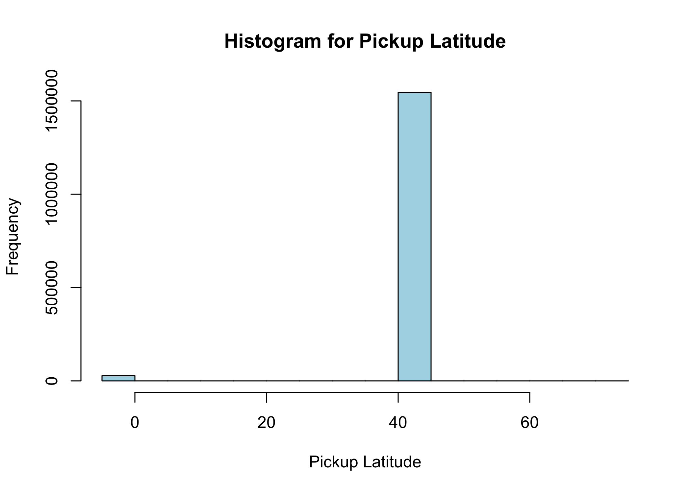

``` r
ggplot(trip_combined_sample, aes(x="pickup_latitude", y=pickup_latitude)) +
  geom_boxplot() +
  labs(x = "", y = "")+
  ggtitle("Box Plot for Pickup Latitude") +
  theme(panel.background = element_blank(), 
        axis.line = element_line(colour = "black"), 
        plot.title = element_text(hjust = 0.5))+
  theme(legend.position = "none") + 
  theme(axis.title.x = element_blank(),
        axis.text.x = element_blank(),
        axis.ticks.x = element_blank()) +
  scale_colour_tableau()
```

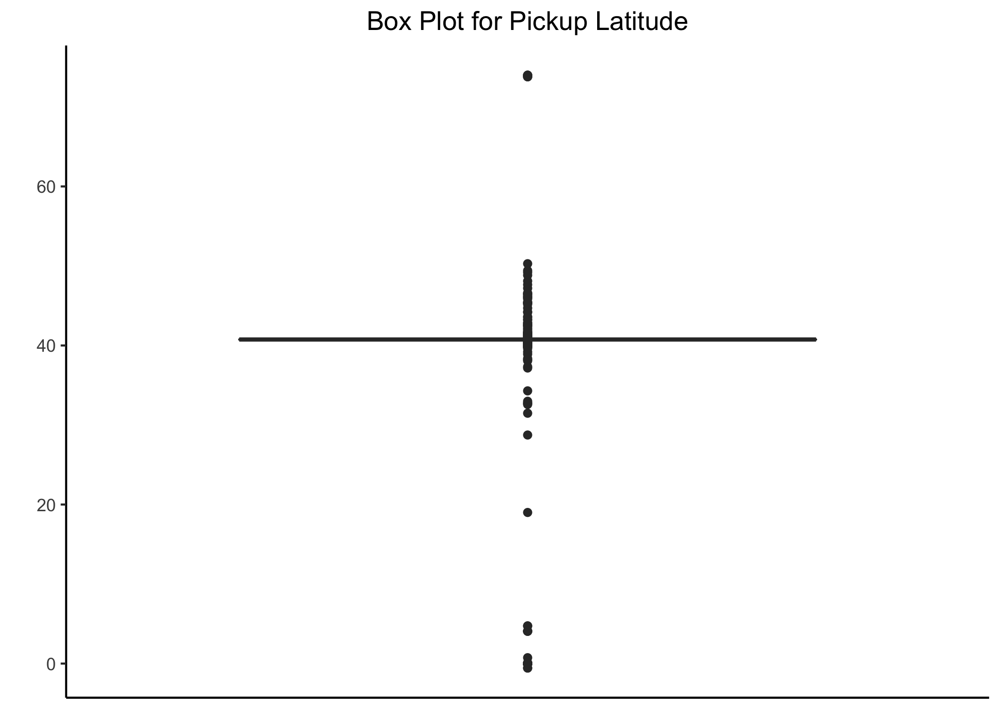

We know that NYC is in northern hemisphere. Some of the pickups are from
equator (latitude = 0) and some are from southern hemisphere.  
Clearly data is either wrongly captured or there were errors in
capturing the data.

``` r
hist(trip_combined_sample$pickup_longitude,
     main="Histogram for Pickup Longitude", 
     xlab="Pickup Longitude", 
     border="black", 
     col="lightblue")
```

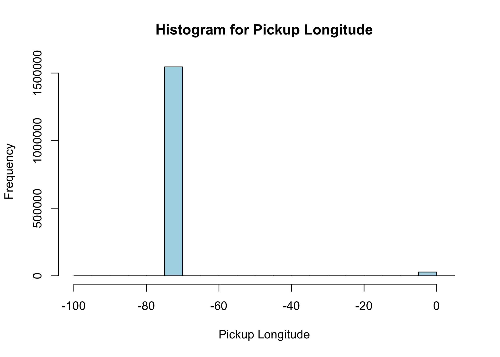

``` r
ggplot(trip_combined_sample, aes(x="pickup_longitude", y=pickup_longitude)) +
  geom_boxplot() +
  labs(x = "", y = "")+
  ggtitle("Box Plot for Pickup Longitude") +
  theme(panel.background = element_blank(), 
        axis.line = element_line(colour = "black"), 
        plot.title = element_text(hjust = 0.5))+
  theme(legend.position = "none") + 
  theme(axis.title.x = element_blank(),
        axis.text.x = element_blank(),
        axis.ticks.x = element_blank()) +
  scale_colour_tableau()
```

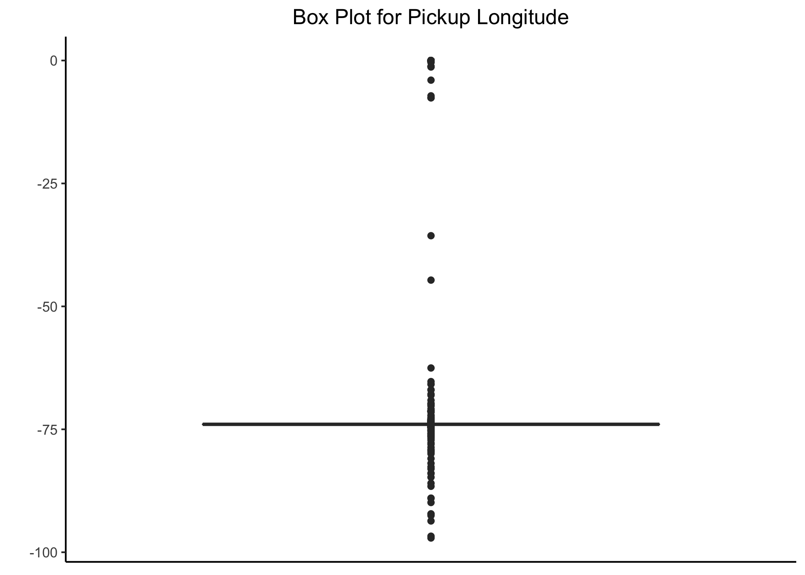

``` r
hist(trip_combined_sample$dropoff_latitude,
     main="Histogram for Dropoff Latitude", 
     xlab="Dropoff Latitude", 
     border="black", 
     col="lightblue")
```


``` r
ggplot(trip_combined_sample, aes(x="dropoff_latitude", y=dropoff_latitude)) +
  geom_boxplot() +
  labs(x = "", y = "")+
  ggtitle("Box Plot for Dropoff Latitude") +
  theme(panel.background = element_blank(), 
        axis.line = element_line(colour = "black"), 
        plot.title = element_text(hjust = 0.5))+
  theme(legend.position = "none") + 
  theme(axis.title.x = element_blank(),
        axis.text.x = element_blank(),
        axis.ticks.x = element_blank()) +
  scale_colour_tableau()
```

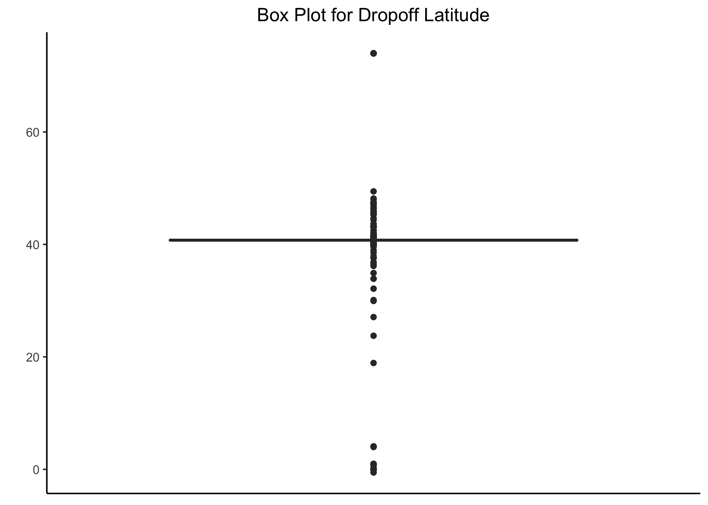

``` r
hist(trip_combined_sample$dropoff_longitude,
     main="Histogram for Dropoff Longitude", 
     xlab="Dropoff Longitude", 
     border="black", 
     col="lightblue")
```

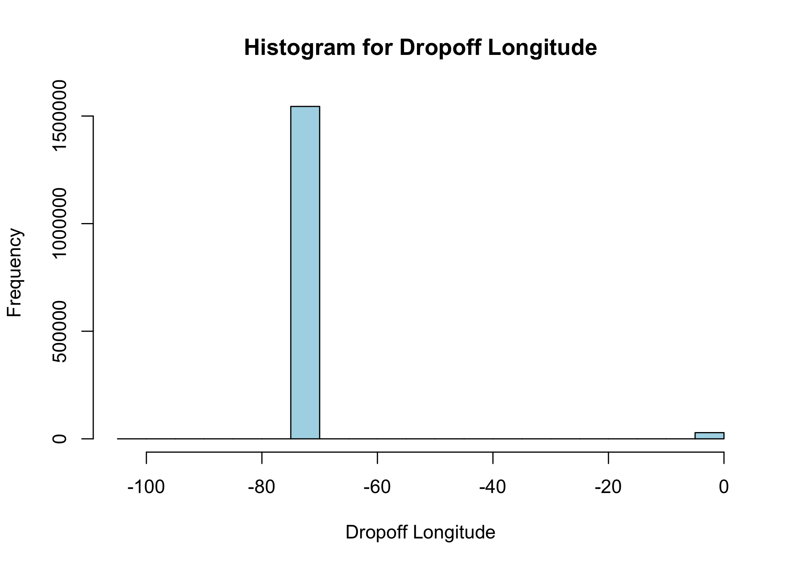

``` r
ggplot(trip_combined_sample, aes(x="dropoff_longitude", y=dropoff_longitude)) +
  geom_boxplot() +
  labs(x = "", y = "")+
  ggtitle("Box Plot for Dropoff Longitude") +
  theme(panel.background = element_blank(), 
        axis.line = element_line(colour = "black"), 
        plot.title = element_text(hjust = 0.5)) +
  theme(legend.position = "none") + 
  theme(axis.title.x = element_blank(),
        axis.text.x = element_blank(),
        axis.ticks.x = element_blank()) +
  scale_colour_tableau()
```

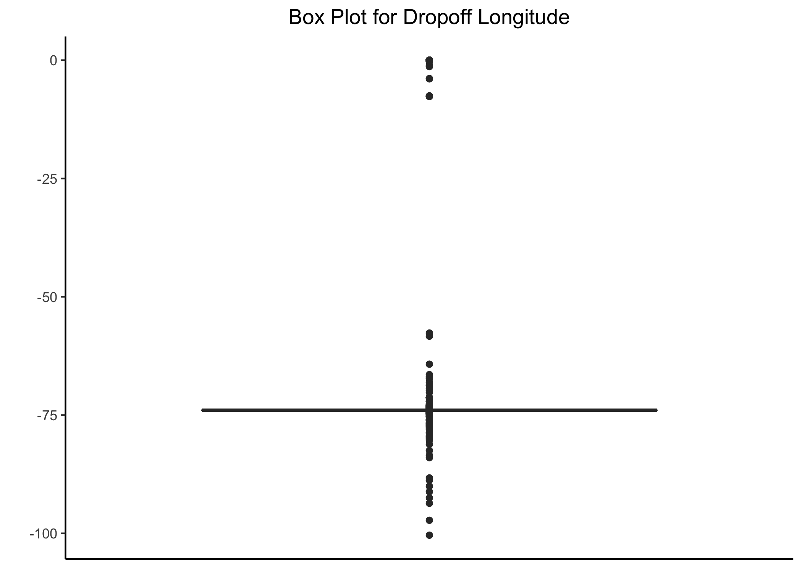

Since we are dealing with New York data, the lat and long can further be
limited to New York and nearby. NYC coordinates are 40.7141667 lat and
-74.0063889 long and if we restrict the pickups and drops within 1000 km
radius, we should have a reliable dataset about the NYC taxi trips
only

``` r
# NYC range within 1000 kms radius (1 degree equal appox 111 kms) and NYC coordinates are 40.7141667 lat and -74.0063889 long
trip_combined_sample <- trip_combined_sample[pickup_latitude %between% c(30, 50) & pickup_longitude %between% c(-84, -64)]

trip_combined_sample <- trip_combined_sample[dropoff_latitude %between% c(30, 50) & dropoff_longitude %between% c(-84, -64)]

#boxplot.stats(trip_combined_sample$pickup_longitude)
```

Let’s visualize the pick-up lat longs on the map. We can see that most
of trips are concentrated around Manhattan borough (often referred as
the city) and some of the pick-ups are from nearby airports.

``` r
leaflet(data = head(trip_combined_sample, 1000)) %>%
  addTiles()%>%
  #addProviderTiles("Stamen.TonerLite")%>%
  #addProviderTiles("Esri.NatGeoWorldMap") %>%
  addCircleMarkers(~ pickup_longitude, ~pickup_latitude, radius = 1,
                   color = "navy", fillOpacity = 0.3)
```

<!--html_preserve-->

<div id="htmlwidget-af4dad811b14904d406c" class="leaflet html-widget" style="width:600px;height:600px;">

</div>

<script type="application/json" data-for="htmlwidget-af4dad811b14904d406c">{"x":{"options":{"crs":{"crsClass":"L.CRS.EPSG3857","code":null,"proj4def":null,"projectedBounds":null,"options":{}}},"calls":[{"method":"addTiles","args":["//{s}.tile.openstreetmap.org/{z}/{x}/{y}.png",null,null,{"minZoom":0,"maxZoom":18,"tileSize":256,"subdomains":"abc","errorTileUrl":"","tms":false,"noWrap":false,"zoomOffset":0,"zoomReverse":false,"opacity":1,"zIndex":1,"detectRetina":false,"attribution":"&copy; <a href=\"http://openstreetmap.org\">OpenStreetMap<\/a> contributors, <a href=\"http://creativecommons.org/licenses/by-sa/2.0/\">CC-BY-SA<\/a>"}]},{"method":"addCircleMarkers","args":[[40.754684,40.736347,40.707794,40.78532,40.794544,40.711349,40.74728,40.75034,40.756184,40.771851,40.755917,40.732803,40.740295,40.755665,40.768394,40.731937,40.743649,40.806969,40.757679,40.768188,40.786461,40.73077,40.755939,40.762829,40.750145,40.745651,40.790554,40.790928,40.741512,40.75996,40.737633,40.736908,40.737675,40.759968,40.763363,40.797756,40.786072,40.748722,40.760265,40.769257,40.786583,40.763542,40.742683,40.758198,40.741783,40.715164,40.710575,40.770229,40.763905,40.771534,40.771885,40.737232,40.759449,40.75539,40.754307,40.781456,40.70549,40.758099,40.762726,40.75214,40.752094,40.762039,40.754436,40.757687,40.76931,40.766594,40.751167,40.784569,40.758091,40.770763,40.750656,40.776146,40.751656,40.741226,40.754742,40.765457,40.769753,40.712254,40.715881,40.759789,40.750122,40.758842,40.76709,40.737232,40.735943,40.750378,40.77837,40.784416,40.762787,40.746197,40.729954,40.797279,40.775532,40.714195,40.722942,40.776127,40.815891,40.774681,40.830116,40.772694,40.725071,40.782799,40.807056,40.717384,40.732941,40.756519,40.725914,40.772991,40.765202,40.765209,40.768223,40.737083,40.721897,40.747074,40.748959,40.743469,40.71524,40.759537,40.772747,40.763309,40.756207,40.743626,40.720177,40.763756,40.755077,40.74194,40.742847,40.782768,40.76878,40.756905,40.756207,40.765339,40.71183,40.77906,40.751896,40.74456,40.76498,40.7267,40.733807,40.743088,40.739681,40.722282,40.742027,40.729576,40.759842,40.759792,40.751057,40.717182,40.739071,40.73204,40.755516,40.721317,40.73016,40.796986,40.759918,40.760265,40.755527,40.765034,40.739452,40.71347,40.734905,40.783165,40.739567,40.721088,40.754089,40.779659,40.764324,40.810085,40.736382,40.751297,40.781483,40.780689,40.728439,40.742016,40.750431,40.740776,40.808636,40.721172,40.739502,40.757877,40.802776,40.722729,40.722729,40.756416,40.756832,40.736427,40.771633,40.714474,40.778454,40.721622,40.810757,40.787994,40.762993,40.762993,40.762993,40.712574,40.716465,40.765598,40.773724,40.811268,40.774033,40.774033,40.808449,40.719574,40.726189,40.745583,40.746048,40.792767,40.782715,40.723759,40.746521,40.735199,40.773994,40.738113,40.754517,40.744839,40.722912,40.744087,40.750271,40.767559,40.726219,40.720924,40.740116,40.698654,40.761425,40.768978,40.760159,40.745224,40.769199,40.799408,40.728065,40.755203,40.810745,40.730091,40.764622,40.726658,40.807484,40.763546,40.727177,40.729561,40.795376,40.764553,40.718143,40.736568,40.722008,40.763798,40.72649,40.763748,40.713184,40.768703,40.731533,40.737423,40.73753,40.759193,40.796597,40.778805,40.725452,40.724297,40.721909,40.782787,40.761684,40.714466,40.720173,40.749222,40.761833,40.735336,40.724991,40.684151,40.725758,40.706982,40.705151,40.733086,40.719532,40.72776,40.736912,40.718735,40.702812,40.778423,40.768585,40.729969,40.736568,40.75145,40.762779,40.75621,40.750088,40.728252,40.727291,40.738285,40.766724,40.784622,40.758423,40.759041,40.751549,40.717297,40.727146,40.756039,40.751556,40.726032,40.720303,40.774193,40.788731,40.727039,40.756042,40.780025,40.708332,40.706219,40.760433,40.776161,40.799946,40.733562,40.746071,40.757156,40.761284,40.746605,40.726826,40.767593,40.769745,40.749962,40.733883,40.785069,40.779408,40.705006,40.767536,40.734871,40.784672,40.743347,40.753056,40.744274,40.767113,40.759735,40.763264,40.743443,40.713863,40.758072,40.736546,40.731323,40.76313,40.732231,40.700588,40.704956,40.770798,40.7057,40.765888,40.767216,40.777863,40.772491,40.775696,40.758068,40.766548,40.73798,40.76841,40.744026,40.715004,40.778576,40.736553,40.834854,40.774563,40.75972,40.755402,40.759071,40.755768,40.762718,40.762814,40.773567,40.768349,40.723217,40.728546,40.779949,40.752453,40.779758,40.722107,40.742496,40.748596,40.742218,40.7813,40.774284,40.748692,40.758526,40.763565,40.705605,40.766514,40.787685,40.777832,40.747345,40.742306,40.756569,40.782387,40.714012,40.800507,40.792088,40.757004,40.770161,40.748531,40.756859,40.742123,40.731487,40.789196,40.774227,40.745373,40.841099,40.749638,40.745468,40.775928,40.773685,40.763199,40.77026,40.739212,40.750755,40.772926,40.773682,40.779449,40.791119,40.748657,40.724361,40.759445,40.737656,40.731358,40.770218,40.784317,40.743477,40.76041,40.79575,40.758656,40.771221,40.78838,40.76947,40.771587,40.783669,40.787529,40.756248,40.792076,40.758343,40.742821,40.754192,40.751301,40.726933,40.828449,40.774117,40.795334,40.77087,40.766445,40.754276,40.759403,40.75304,40.750595,40.722195,40.790173,40.767166,40.790691,40.766918,40.765182,40.704964,40.810772,40.755829,40.781094,40.761738,40.774654,40.757023,40.798603,40.739101,40.751244,40.756565,40.797348,40.797371,40.812138,40.769115,40.721851,40.737396,40.746086,40.774261,40.771244,40.756962,40.767792,40.791622,40.774326,40.794563,40.759315,40.774487,40.785877,40.756004,40.725628,40.786453,40.743462,40.792027,40.778248,40.754063,40.769188,40.799545,40.781902,40.773914,40.77087,40.778294,40.755741,40.780575,40.745235,40.770317,40.716621,40.755814,40.738335,40.757023,40.706184,40.780224,40.729923,40.742054,40.735172,40.73904,40.756748,40.764496,40.734539,40.770164,40.739094,40.774593,40.739574,40.770721,40.784767,40.753242,40.646988,40.75,40.750023,40.763481,40.79303,40.755665,40.764732,40.761345,40.756737,40.741035,40.819572,40.731361,40.738628,40.743351,40.729626,40.769161,40.754745,40.76387,40.754204,40.758945,40.753498,40.760441,40.762199,40.723103,40.742722,40.714085,40.680855,40.720718,40.721279,40.731159,40.719482,40.76432,40.774155,40.724491,40.724792,40.745621,40.740211,40.783272,40.735245,40.675076,40.716137,40.718765,40.724663,40.736977,40.754589,40.732574,40.794792,40.752083,40.763489,40.734917,40.747662,40.754372,40.751019,40.708672,40.749451,40.81002,40.751259,40.722481,40.761703,40.746948,40.774239,40.740891,40.722889,40.751373,40.76363,40.755257,40.749519,40.743656,40.748077,40.734741,40.758312,40.749935,40.751942,40.780685,40.711334,40.768604,40.759968,40.741459,40.7439,40.765343,40.759457,40.710255,40.762562,40.788189,40.773804,40.751656,40.773762,40.773819,40.773697,40.742439,40.752403,40.774338,40.774044,40.71003,40.768467,40.776669,40.749928,40.751717,40.760036,40.760036,40.762283,40.764591,40.740246,40.778778,40.781208,40.738846,40.786736,40.785561,40.75861,40.759167,40.741001,40.709972,40.74551,40.776577,40.750259,40.719688,40.750946,40.773582,40.763275,40.739799,40.743916,40.718842,40.776535,40.721863,40.731457,40.732712,40.731331,40.740822,40.747887,40.73455,40.783661,40.734558,40.762459,40.731361,40.758732,40.797848,40.752548,40.758644,40.778252,40.762966,40.730022,40.753231,40.755592,40.753944,40.755882,40.771561,40.747334,40.751621,40.768147,40.776062,40.736416,40.724155,40.740936,40.756924,40.796696,40.741631,40.758503,40.748459,40.684696,40.756905,40.704739,40.804207,40.776428,40.76421,40.716667,40.76506,40.755821,40.747684,40.710789,40.76672,40.767906,40.745003,40.742401,40.746063,40.746696,40.724594,40.760609,40.764214,40.717983,40.744011,40.723526,40.764931,40.746559,40.726109,40.7612,40.761181,40.733337,40.754868,40.734566,40.769733,40.756851,40.746552,40.739037,40.757561,40.723461,40.729397,40.735729,40.734173,40.718906,40.760941,40.747025,40.771446,40.753227,40.744751,40.740185,40.750973,40.729698,40.780857,40.759594,40.740711,40.752831,40.763023,40.706284,40.731403,40.751068,40.737095,40.730637,40.765278,40.732632,40.748112,40.7411,40.762985,40.764675,40.772179,40.777615,40.807083,40.773792,40.772266,40.722027,40.714424,40.762707,40.722176,40.719154,40.748081,40.782639,40.764675,40.777485,40.76239,40.763348,40.718189,40.756622,40.764931,40.720566,40.742432,40.745823,40.763168,40.760902,40.787113,40.721783,40.755196,40.751366,40.745811,40.72551,40.762283,40.704605,40.784718,40.749126,40.713093,40.757587,40.747391,40.767757,40.717262,40.727474,40.762463,40.751411,40.755772,40.747761,40.724419,40.733215,40.755741,40.783329,40.793465,40.789494,40.772892,40.790771,40.769855,40.781845,40.759472,40.734039,40.718636,40.759972,40.75333,40.765789,40.74115,40.768517,40.756271,40.755795,40.740543,40.771221,40.756104,40.743973,40.741199,40.751144,40.782574,40.771641,40.740696,40.773739,40.729324,40.792057,40.78933,40.763401,40.782349,40.75563,40.771751,40.759716,40.759026,40.754734,40.733635,40.752991,40.770527,40.741627,40.740826,40.765968,40.806953,40.797028,40.783409,40.753185,40.763783,40.7673,40.768913,40.77113,40.769211,40.811012,40.759865,40.766663,40.790016,40.787128,40.770592,40.776699,40.757023,40.789314,40.796688,40.723385,40.792316,40.752899,40.78339,40.779953,40.761757,40.771271,40.775894,40.757614,40.762421,40.786789,40.764332,40.748493,40.756844,40.745186,40.641197,40.765251,40.751942,40.769157,40.762863,40.77177,40.756115,40.769299,40.78931,40.772156,40.778137,40.804436,40.718472,40.697815,40.759968,40.740322,40.693172,40.716698,40.725372,40.756241,40.761448,40.800171,40.787079,40.717827,40.750755,40.754616,40.759327,40.765671,40.76289,40.774696,40.712002,40.734375,40.719814,40.730122,40.734959,40.750771,40.75573,40.755447,40.768463,40.777821,40.77634,40.75351,40.64711,40.721455,40.759407,40.748562,40.730793,40.738949,40.711803,40.740295,40.726738,40.748009,40.737934,40.749767,40.74905,40.723862,40.674934,40.751125,40.730492,40.771313,40.763542,40.751541,40.74382,40.758575,40.785774,40.803558,40.717583,40.763615,40.72681,40.736423,40.775879,40.734386,40.749054,40.741508,40.7533,40.725574,40.730316,40.718304,40.737274,40.739628,40.757706,40.739727,40.74474,40.741207,40.743885,40.761688,40.742325,40.762081,40.749264,40.760818,40.743565,40.821819,40.739578,40.739773,40.766563,40.745129,40.747223,40.745663,40.746666,40.742512,40.765293,40.744125,40.744183,40.749168,40.732204,40.739799,40.718979,40.738708,40.750881,40.731625,40.736778,40.74181,40.744709,40.76458,40.749126,40.720497,40.720222,40.723072,40.753128,40.737869,40.752914,40.748337,40.758293,40.743626,40.727066,40.754005,40.727299,40.741295,40.719707,40.711346,40.729488,40.729305,40.72739,40.719898,40.725689,40.77195,40.766285],[-73.999268,-74.000793,-74.003845,-73.969513,-73.972069,-74.009697,-73.983459,-73.992012,-73.991386,-73.963486,-73.990639,-73.99144,-73.998589,-73.993767,-73.98217,-74.003456,-73.999657,-73.942055,-73.971817,-73.967964,-73.979927,-73.992249,-73.988495,-73.983017,-73.991287,-73.990791,-73.976662,-73.974342,-73.978386,-73.976494,-74.001549,-73.979141,-73.980736,-73.970276,-73.973557,-73.948616,-73.980194,-73.978455,-73.958344,-73.954948,-73.972496,-73.982384,-73.981094,-73.982071,-73.974915,-74.013466,-74.008362,-73.961189,-73.985435,-73.963249,-73.959366,-74.000664,-73.977051,-73.964828,-73.969666,-73.952065,-74.007835,-73.985771,-73.956841,-73.977188,-73.977951,-73.986275,-73.991959,-73.971802,-73.96727,-73.953873,-73.991348,-73.970276,-73.988861,-73.981979,-73.988327,-73.960274,-73.976807,-73.994568,-73.976128,-73.971954,-73.962852,-74.008049,-74.008659,-73.976288,-73.991371,-73.964561,-73.953743,-73.981491,-73.985657,-73.974121,-73.974525,-73.979637,-73.974159,-73.993927,-73.978035,-73.96978,-73.961983,-73.955864,-73.991302,-73.951691,-73.958344,-73.982063,-73.936592,-73.955116,-73.992416,-73.94577,-73.954193,-73.955566,-73.987595,-73.92762,-74.001663,-73.982117,-73.972458,-73.980072,-73.966194,-74.00145,-73.958504,-73.981361,-73.991905,-73.983131,-73.996925,-73.991982,-73.885254,-73.98912,-73.972214,-73.988113,-73.996132,-73.97641,-73.995087,-74.000885,-74.007233,-73.978401,-73.98468,-73.988655,-73.991058,-73.982292,-74.007851,-73.945076,-73.974998,-73.991203,-73.987816,-73.986015,-74.002151,-73.952141,-73.997978,-73.986176,-74.000862,-73.981003,-73.987976,-73.976456,-73.986412,-73.998634,-73.982559,-73.993668,-73.98494,-73.986931,-74.000359,-73.937584,-73.965424,-73.988007,-73.973518,-73.979095,-73.984795,-74.015526,-74.000465,-73.947784,-73.983337,-73.99334,-73.976799,-73.953362,-73.966614,-73.95874,-74.005798,-73.993927,-73.954231,-73.981384,-73.994026,-73.989044,-73.991058,-74.005341,-73.963577,-74.055199,-73.995293,-73.989204,-73.963493,-73.993683,-73.993683,-73.990524,-73.983871,-74.001205,-73.982712,-73.953033,-73.98201,-74.004379,-73.954376,-73.967499,-73.982788,-73.982788,-73.982788,-73.999168,-73.997154,-73.99469,-73.870979,-73.961922,-73.992455,-73.992455,-73.959846,-73.991333,-73.998459,-73.990929,-73.978035,-73.967606,-73.955612,-73.987976,-73.977646,-73.979912,-73.959656,-73.977829,-73.96582,-73.976158,-73.988976,-74.003319,-73.973839,-73.9832,-73.983948,-73.99765,-73.986481,-73.992424,-73.966492,-73.958344,-73.975609,-73.987328,-73.95491,-73.96283,-73.979134,-73.991302,-73.962021,-74.002037,-73.972397,-74.007454,-73.941597,-73.967331,-74.007401,-73.983795,-73.973007,-73.970085,-74.005402,-73.988754,-73.986313,-73.988815,-73.97924,-73.985672,-74.009308,-73.984901,-73.982758,-74.004921,-74.005127,-73.972321,-73.972206,-73.951279,-73.977882,-73.978775,-73.986542,-73.971298,-73.97477,-73.992584,-74.00293,-73.988205,-73.971001,-74.008446,-73.981346,-73.978409,-74.005623,-74.011917,-74.011276,-73.998055,-73.986916,-73.993195,-74.001282,-73.945061,-73.933769,-73.985611,-73.984673,-73.992889,-74.00589,-73.980072,-73.978615,-73.972557,-73.991608,-73.988007,-74.005447,-73.983704,-73.983238,-73.973473,-73.9711,-73.979622,-73.974655,-73.995331,-73.991425,-73.973038,-73.986099,-73.983307,-74.010147,-73.945396,-73.978043,-73.980392,-73.987244,-73.977005,-74.010612,-74.009605,-73.987427,-73.947937,-73.940842,-73.980072,-73.913002,-73.960907,-73.980614,-73.912109,-73.999908,-73.969032,-73.951645,-73.970467,-73.980804,-73.973183,-73.977257,-74.008308,-73.990135,-73.990646,-73.973534,-73.918709,-73.974831,-73.924316,-73.953636,-73.995499,-73.978401,-73.918602,-74.008835,-73.966347,-73.984833,-74.006729,-73.96505,-73.980392,-73.990616,-74.009682,-73.950958,-74.008141,-73.976746,-73.986404,-73.951881,-73.960823,-73.950516,-73.984467,-73.962662,-73.98671,-73.984718,-74.006737,-74.011559,-73.988525,-73.990921,-73.944504,-73.981026,-73.991859,-73.99482,-73.96566,-73.990288,-73.979691,-73.959755,-73.983513,-73.992958,-73.999138,-74.004799,-73.984444,-73.978584,-73.955971,-74.008392,-74.007011,-74.008087,-74.006142,-73.97998,-73.988686,-74.003387,-73.969406,-73.928383,-74.009682,-73.986694,-73.967697,-73.988731,-73.982925,-74.006363,-73.970474,-73.982819,-74.008995,-73.958565,-73.975578,-73.963676,-73.964775,-73.994408,-73.974159,-73.98494,-73.982727,-73.977737,-73.984718,-74.005951,-73.939926,-73.99514,-73.985184,-73.989883,-73.98365,-73.9701,-73.964394,-73.999359,-73.991013,-73.982353,-73.982208,-73.955376,-73.9534,-74.008186,-73.97879,-73.965088,-73.989723,-73.975388,-73.951363,-73.972992,-73.999985,-73.987473,-73.932732,-73.977005,-73.949181,-73.980774,-73.958115,-73.950836,-73.979996,-73.978928,-73.961281,-73.941444,-73.992691,-73.996437,-73.969154,-73.993996,-74.00341,-73.949196,-73.874619,-73.971367,-73.953773,-73.967087,-73.999382,-73.965195,-73.987022,-73.988586,-73.988838,-73.973175,-73.98391,-73.942314,-73.956711,-73.98333,-74.01725,-73.952728,-73.964737,-73.979897,-73.994057,-73.988228,-73.963776,-73.95977,-73.999413,-73.997223,-73.964378,-73.960457,-73.948883,-73.942513,-73.886711,-73.843918,-73.991066,-73.991875,-73.872917,-73.950638,-73.993706,-73.993393,-73.972122,-73.951149,-73.97197,-73.98896,-73.95787,-73.972618,-73.967804,-74.005119,-73.96875,-73.984062,-73.964439,-73.954422,-73.970428,-73.95192,-73.938896,-73.954613,-73.966042,-73.951035,-73.958412,-73.983337,-73.927284,-73.990578,-73.917877,-74.016502,-73.972542,-74.003998,-73.990242,-74.009102,-73.9813,-73.980637,-73.986092,-74.006279,-73.994537,-73.966904,-73.995697,-73.994408,-73.866364,-73.987511,-73.988457,-73.989014,-73.950996,-73.97731,-73.996407,-73.789452,-73.999207,-74.002487,-73.96965,-73.967575,-73.991966,-73.99575,-73.982185,-73.969887,-74.005722,-73.951836,-73.982307,-73.985519,-74.00737,-73.860519,-73.862671,-73.975533,-73.978539,-73.968925,-73.988266,-73.969704,-73.980064,-73.997398,-74.004921,-73.99305,-73.990364,-73.994453,-73.988991,-73.99865,-73.974266,-73.993439,-73.987068,-73.872971,-73.985268,-73.981384,-73.984314,-74.005692,-73.978607,-74.006035,-73.981346,-73.962364,-73.989311,-73.99437,-73.978844,-73.972176,-73.987846,-73.966179,-73.967674,-73.985435,-73.991013,-73.983261,-73.969147,-73.974327,-74.011009,-73.991341,-73.964012,-73.976059,-73.988777,-73.979439,-73.972107,-73.873055,-73.987976,-73.985817,-73.976868,-73.996216,-73.973495,-73.972542,-73.986061,-73.991516,-73.986839,-73.969772,-73.992699,-73.976738,-73.972878,-74.017227,-73.984718,-73.982475,-74.001167,-73.973488,-73.954956,-73.978249,-74.009995,-73.981819,-73.944244,-73.87088,-73.976372,-73.87085,-73.870651,-73.871025,-74.004776,-73.978081,-73.872826,-73.873032,-74.013939,-73.982178,-73.977226,-73.977501,-73.977493,-73.965019,-73.965019,-73.971748,-73.977379,-74.00209,-73.947922,-73.979355,-74.003357,-73.972572,-73.94989,-73.971657,-73.968697,-74.007446,-74.009987,-73.97821,-73.952652,-74.002296,-73.95565,-73.982727,-73.951851,-73.97126,-74.002228,-73.985321,-73.956635,-73.952675,-74.004265,-74.000969,-73.997261,-73.988754,-74.006958,-73.99263,-73.999855,-73.950493,-73.98835,-73.926468,-73.988686,-73.989456,-73.969589,-73.993317,-73.972794,-73.960724,-73.967072,-73.983429,-73.974838,-73.965401,-73.942459,-73.973892,-73.982437,-73.986168,-73.978165,-73.986298,-73.955757,-73.997421,-73.984947,-74.000435,-73.989922,-73.970375,-73.98571,-73.971291,-74.005959,-73.991829,-74.00132,-74.016388,-73.963058,-73.952805,-73.971642,-74.009178,-73.976807,-73.967987,-73.980942,-74.005951,-73.96183,-73.980942,-73.99868,-73.980507,-73.998245,-73.985779,-73.99778,-73.930237,-73.968895,-73.995064,-73.987816,-73.988319,-73.991318,-73.993454,-74.005585,-73.975815,-73.963943,-73.987076,-73.97348,-73.990646,-73.995453,-73.967155,-73.990257,-73.991417,-73.978394,-74.003067,-73.984123,-74.005936,-73.993294,-74.008904,-73.974297,-73.993584,-73.947098,-73.978539,-73.998741,-73.986618,-74.004349,-73.998581,-73.958977,-73.991653,-73.985901,-73.977715,-73.996773,-74.006638,-73.98867,-74.00531,-73.992859,-73.986984,-73.993614,-74.003326,-73.974113,-73.989891,-73.965706,-73.970291,-73.95295,-73.982323,-73.94194,-73.951675,-73.989815,-73.996513,-73.999565,-73.977058,-73.996529,-73.98938,-73.98526,-73.955467,-73.971977,-73.949051,-73.973534,-73.982735,-73.99781,-73.993118,-73.978745,-73.952568,-73.974525,-73.978371,-73.965546,-73.968758,-73.941795,-73.99192,-73.965126,-73.993683,-73.994385,-73.992004,-73.965828,-74.007301,-73.951859,-73.982048,-73.958504,-73.98214,-73.985313,-73.963867,-73.95681,-73.985313,-73.977264,-73.993881,-73.986626,-73.989265,-73.990776,-74.005737,-73.970947,-73.978523,-73.966858,-73.952621,-73.963989,-73.95369,-73.968452,-73.948837,-73.976677,-74.004631,-73.956154,-73.979317,-73.985031,-73.987396,-73.981491,-73.955154,-73.98539,-73.990669,-74.002144,-73.982407,-73.983513,-73.976402,-73.975494,-73.994118,-73.971466,-73.956299,-74.006943,-73.962151,-73.989899,-73.975548,-73.954552,-73.959183,-73.959816,-73.976761,-73.986694,-73.976379,-73.972786,-73.968567,-73.99176,-73.991585,-73.98732,-73.987312,-73.985786,-73.919312,-73.960892,-73.968262,-73.980209,-73.981087,-73.966118,-73.984604,-73.862816,-73.953217,-73.95208,-73.963364,-73.960327,-73.98307,-73.952194,-73.956276,-73.950951,-73.979347,-73.971794,-73.952423,-73.972122,-73.976311,-73.952568,-73.970184,-73.970688,-73.977097,-73.972191,-73.917778,-73.944183,-73.963303,-73.968269,-73.973747,-73.95845,-73.980011,-73.97863,-73.994774,-73.787331,-73.997635,-73.992935,-73.995956,-73.983215,-73.990395,-73.990387,-73.995834,-73.954636,-73.952736,-73.954666,-73.966278,-73.990784,-73.926872,-73.986771,-73.981789,-73.968742,-73.958786,-74.004761,-73.990166,-73.995255,-73.968231,-73.968048,-74.014397,-73.971191,-73.993553,-73.98835,-73.990334,-73.978195,-73.977509,-73.962502,-73.99086,-73.985893,-73.954208,-73.999069,-73.984009,-73.986771,-73.972267,-73.863396,-73.95713,-73.96286,-73.994888,-73.788994,-74.001823,-73.972801,-73.973053,-73.993057,-73.987244,-74.007851,-73.982018,-73.98629,-73.985176,-73.980988,-73.991753,-73.97773,-73.985168,-73.981499,-73.971809,-73.991608,-73.987122,-73.962555,-73.976494,-73.992172,-73.977417,-73.975929,-73.967201,-73.999229,-73.980309,-73.985313,-73.988983,-73.953644,-73.981049,-73.992371,-73.978378,-73.980675,-74.005943,-74.001823,-73.987785,-73.996986,-73.985313,-73.971497,-73.995186,-73.995323,-73.978523,-73.985542,-73.990295,-73.983742,-73.979523,-73.994576,-73.969872,-73.986298,-73.953903,-73.995163,-73.990997,-73.967316,-73.987045,-73.993561,-73.994652,-74.001564,-73.984535,-73.980515,-73.985878,-73.984116,-73.992195,-73.994286,-74.005363,-73.989227,-73.999832,-73.981689,-74.001114,-74.005615,-74.00705,-73.990997,-73.97393,-73.983688,-74.008621,-74.005417,-73.998917,-74.003792,-74.001968,-73.976379,-73.989052,-73.963402,-73.987785,-73.999878,-73.936195,-73.988586,-73.988922,-74.004272,-74.008392,-73.987915,-73.998009,-73.993935,-73.992325,-74.005165,-73.9561,-73.952682],1,null,null,{"interactive":true,"className":"","stroke":true,"color":"navy","weight":5,"opacity":0.5,"fill":true,"fillColor":"navy","fillOpacity":0.3},null,null,null,null,null,{"interactive":false,"permanent":false,"direction":"auto","opacity":1,"offset":[0,0],"textsize":"10px","textOnly":false,"className":"","sticky":true},null]}],"limits":{"lat":[40.641197,40.841099],"lng":[-74.055199,-73.787331]}},"evals":[],"jsHooks":[]}</script>

<!--/html_preserve-->

Some of the trips have a trip distance of 0 and some have trip duration
of 0. For this analysis, we will drop them from our datasets

``` r
# Remove zero distance trips
trip_combined_sample <- trip_combined_sample[trip_distance > 0]

# Remove zero time trips
trip_combined_sample <- trip_combined_sample[trip_time_in_secs > 0]
```

## Univariate Analysis

### Distribution of Passenger Count

Most of trips are single passenger trips. We do have 0 passenger trips.
Maybe, they are trips for some delivery and does not include any
passengers. And, there are some trips with 9 passengers. We are not
excluding any trips based on passenger count as all of these seems to be
genuine trips and may contribute towards the fare amount predictions.

``` r
# Count trips group by passenger count
plot_passenger_dist <- trip_combined_sample[, .N, by = list(passenger_count)]

# Convert the passenger count to a categorical variable
plot_passenger_dist$passenger_count <- as.factor(plot_passenger_dist$passenger_count)

# Visualize
ggplot(plot_passenger_dist, aes(passenger_count, N, fill = passenger_count)) +
  geom_col() +
  scale_y_sqrt() +
  labs(x = "Passenger Count", y = "Number of Trips")+
  ggtitle("Histogram of Passenger Count") +
  theme(panel.background = element_blank(), 
        axis.line = element_line(colour = "black"), 
        plot.title = element_text(hjust = 0.5)) +
  theme(legend.position = "none") + 
  scale_colour_tableau()
```

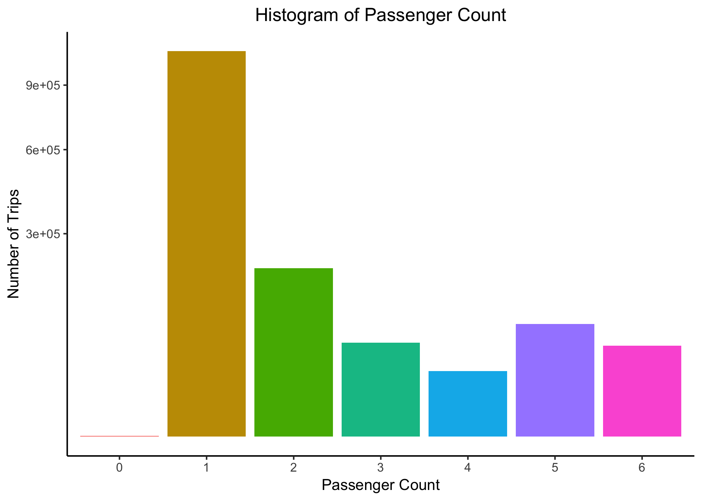

### Distribution of Payment Type

Since there is no data dictionary for the abbreviated payment types. We
are assuming *CRD* means a credit card transaction and *CSH* mean a cash
transaction. *UNK* might be Unknown transactions. Most of the
transactions are either *CRD* or *CSH*.

``` r
# Count trips group by payment type
plot_payment_type_dist <- trip_combined_sample[, .N, by = list(payment_type)]

# Convert the payment type to a categorical variable
plot_payment_type_dist$payment_type <- as.factor(plot_payment_type_dist$payment_type)

# Visualize
ggplot(plot_payment_type_dist, aes(payment_type, N, fill = payment_type)) +
  geom_col() +
  scale_y_sqrt() +
  labs(x = "Payment Type", y = "Number of Trips")+
  ggtitle("Histogram of Payment Type") +
  theme(panel.background = element_blank(), 
        axis.line = element_line(colour = "black"), 
        plot.title = element_text(hjust = 0.5)) +
  theme(legend.position = "none") + 
  scale_colour_tableau()
```

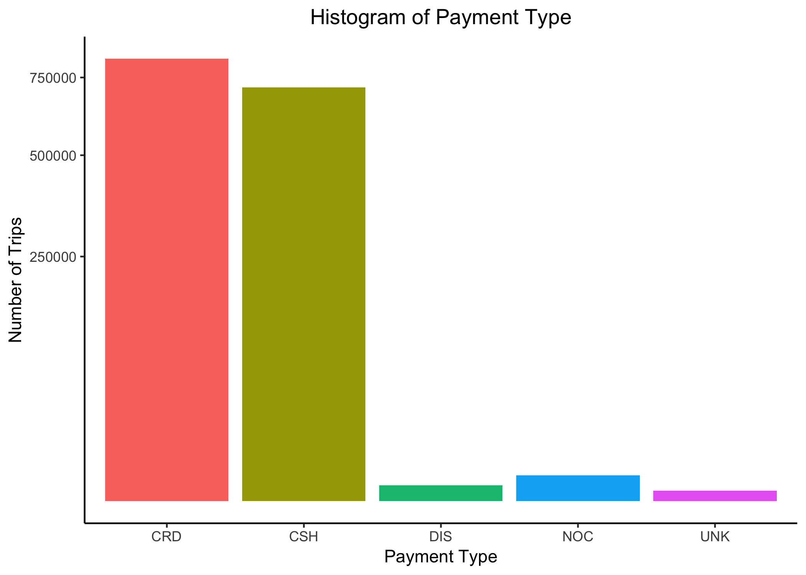

### Distribution of Fare Amount

Most of the trips are under $80 range. Some of the high fare amounts
(\>$100) needs to be explored further. So the fare amount should be a
function of trip distance and trip duration. We will have a look if the
high fares are justified by their corresponding trip distances and
durations or if they are outliers.

``` r
ggplot(trip_combined_sample, aes(fare_amount)) +
  geom_histogram(binwidth = 20,
                 col="black", 
                 fill="light blue") +
  labs(x = "Fare Amount", y = "Number of Trips")+
  ggtitle("Histogram of Fare Amount") +
  theme(panel.background = element_blank(), 
        axis.line = element_line(colour = "black"), 
        plot.title = element_text(hjust = 0.5))+
  theme(legend.position = "none") + 
  scale_colour_tableau()
```

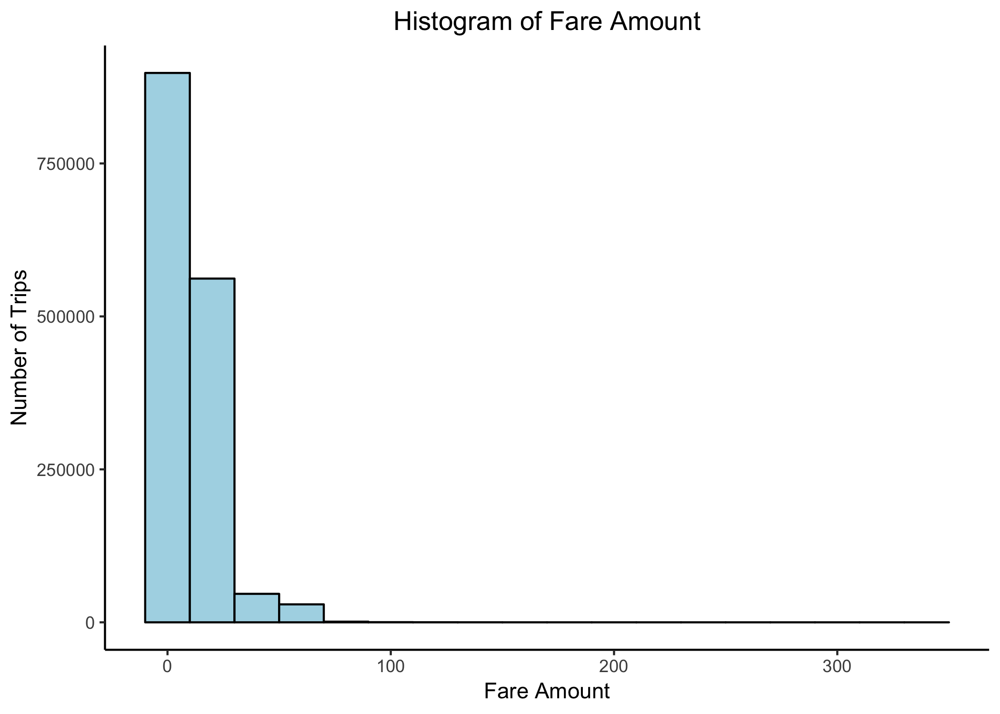

### Distribution of Tip Amount

Most of the tips are under $10 range. Some of the high tip amounts needs
to be explored further along with fare amount to detect any outliers.

``` r
ggplot(trip_combined_sample, aes(tip_amount)) +
  geom_histogram(binwidth = 10,
                 col="black", 
                 fill="light blue") +
  labs(x = "Tip Amount", y = "Number of Trips")+
  ggtitle("Histogram of Tip Amount") +
  theme(panel.background = element_blank(), 
        axis.line = element_line(colour = "black"), 
        plot.title = element_text(hjust = 0.5))+
  theme(legend.position = "none") + 
  scale_colour_tableau()
```

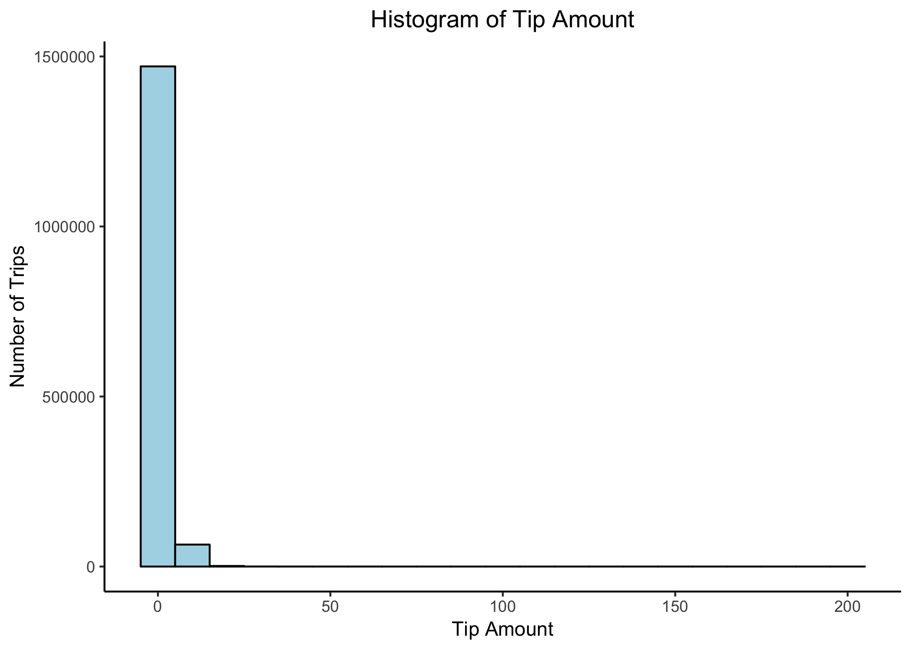

### Distribution of Total Amount

Most of the total amounts are under $100 range and are along the lines
of fare amount.

``` r
ggplot(trip_combined_sample, aes(total_amount)) +
  geom_histogram(binwidth = 20,
                 col="black", 
                 fill="light blue") +
  labs(x = "Total Amount", y = "Number of Trips")+
  ggtitle("Histogram of Total Amount") +
  theme(panel.background = element_blank(), 
        axis.line = element_line(colour = "black"), 
        plot.title = element_text(hjust = 0.5))+
  theme(legend.position = "none") + 
  scale_colour_tableau()
```

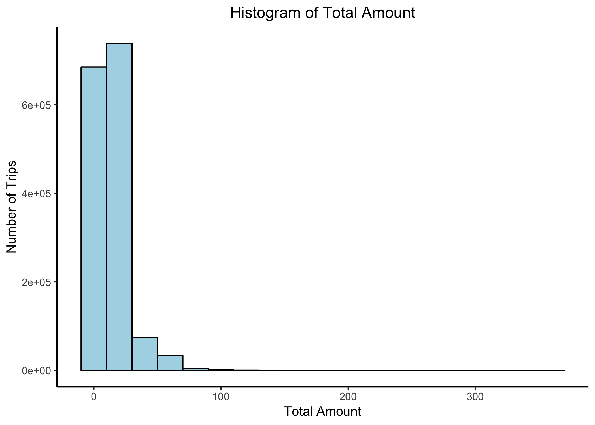

# Feature Engineering

## Fare per unit distance

We know that fare amount comprises of multiple price components such as
starting fare, fare per miles/kms, waiting fares, tolls, surcharges and
other fees. The major component would be fare per miles/kms (for longer
trips). Let’s try to compute a fare per unit distance and try to find
any abnormalities in the data that can impact predicting the fare
prices. We will try to remove any records that are outside 2 standard
deviations.

``` r
trip_combined_sample[, fare_per_dist := (fare_amount/trip_distance)]

# Calculate 2 standard deviations
trip_combined_sample[,.(min_fare = min(fare_per_dist), 
                        max_fare = max(fare_per_dist),
                        sd_2_fare_upper = mean(fare_per_dist) + 2 * sd(fare_per_dist), 
                        sd_2_fare_lower = mean(fare_per_dist) - 2 * sd(fare_per_dist)
                        )
                     ]
```

    ##      min_fare max_fare sd_2_fare_upper sd_2_fare_lower
    ## 1: 0.02777778    10000        46.03531       -34.19328

``` r
# Visualize if the trip duration has an impact on the high fare_per_dist for lower trip distances

ggplot(head(trip_combined_sample, 10000)) + 
  geom_point(aes(x=trip_distance, y=fare_per_dist, col = (trip_time_in_secs/60))) + 
  labs(x = "Trip Distance", y = "Fare amount per unit distance") +
  labs(col = "Trip Time (in mins)") +
  ggtitle("Fare amount per unit distance Vs trip distance & time") +
  theme(panel.background = element_blank(), 
        axis.line = element_line(colour = "black"), 
        plot.title = element_text(hjust = 0.5))
```

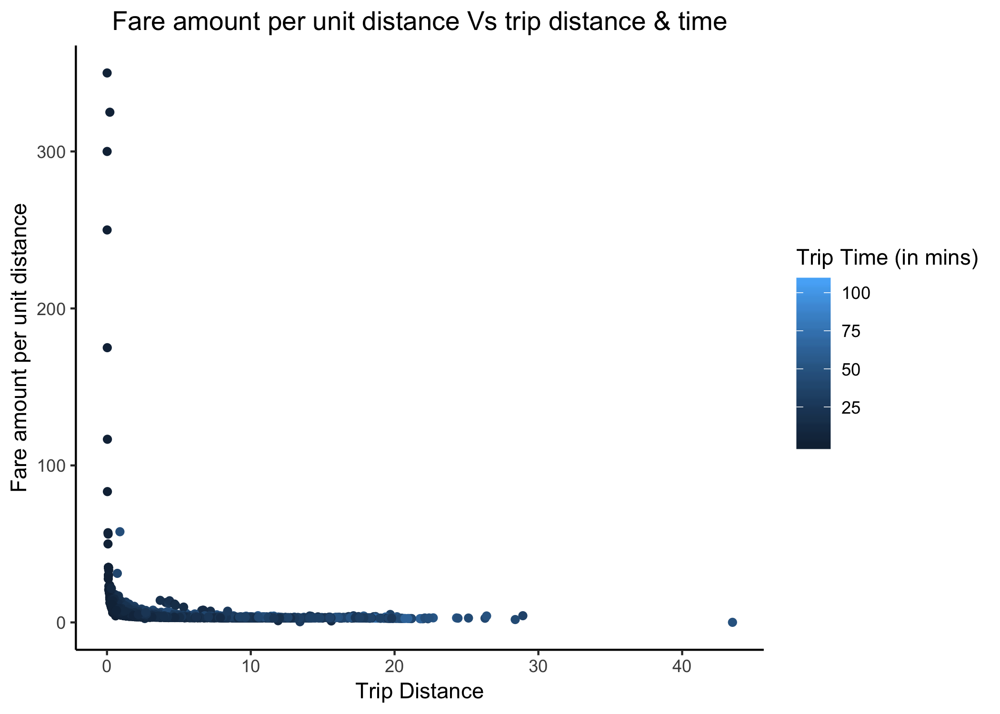

Looking at the chart above, it seems that some of the high fare does not
have that high trip durations. They seem to be outliers. Let’s remove
the extreme tail ends of *fare\_per\_dist* (2 standard
deviations)

``` r
trip_combined_sample <- trip_combined_sample[fare_per_dist < (mean(fare_per_dist) + 2 * sd(fare_per_dist))]
```

## Day of week

To analyse the impact of time/day on the number of trips, let’s create
new features/variables and see the impact of day of week on the volume
of trips
made.

``` r
trip_combined_sample[, pickup_wday := wday(pickup_datetime, label = TRUE)]

plot_wday_trips <- trip_combined_sample[, .N, by = list(pickup_wday, vendor_id)]

ggplot(plot_wday_trips, aes(pickup_wday, N, colour = vendor_id)) +
  geom_point(size = 4) +
  labs(x = "Day of the week", y = "Total number of pickups") +
  labs(col = "Vendor") +
  ggtitle("Taxi trips by day of the week") +
  theme(panel.background = element_blank(), 
        axis.line = element_line(colour = "black"), 
        plot.title = element_text(hjust = 0.5))
```

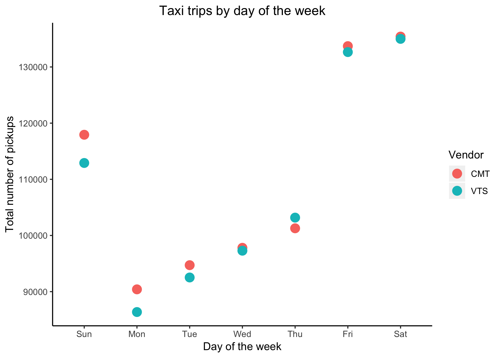

Looking at the chart above, it shows that *Tuesdays* were the busiest
days for the month of April, 2013 followed by *Mondays*, *Saturdays* and
*Fridays*.

## Hour of the day

As the fares are dependent on the time of day (odd hours fares are
higher than normal business hours fares), let’s compute the hour of the
day feature/variable to see the impact of time of the day on the volumes
of trips and average fare amount.

``` r
trip_combined_sample[, pickup_hour := hour(pickup_datetime)]

plot_hourly_trips <- trip_combined_sample[, .N, by = list(pickup_hour)]

ggplot(plot_hourly_trips, aes(reorder(pickup_hour, -N), N, fill = reorder(pickup_hour, -N))) +
  geom_col() +
  scale_y_sqrt() +
  labs(x = "Hour of the day", y = "Total number of pickups") +
  ggtitle("Taxi trips by hour of the day") +
  theme(panel.background = element_blank(), 
        axis.line = element_line(colour = "black"), 
        plot.title = element_text(hjust = 0.5)) +
  theme(legend.position = "none")
```

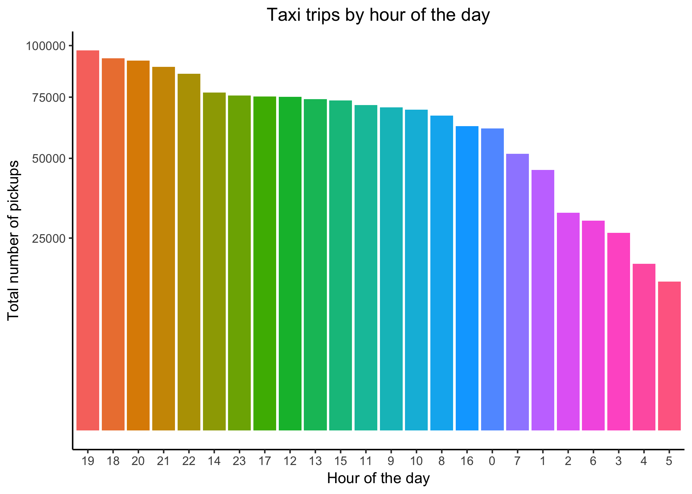

From the chart, it is clear that the busiest hours are 7pm, 6pm, 8pm,
9pm and 10 pm. In short the evening times are the busiest from
6-10pm

``` r
plot_hourly_fares <- trip_combined_sample[, .(mean_hourly_fare = mean(fare_amount)), by = list(pickup_hour)]

ggplot(plot_hourly_fares, aes(reorder(pickup_hour, -mean_hourly_fare), mean_hourly_fare, fill = reorder(pickup_hour, -mean_hourly_fare))) +
  geom_col() +
  scale_y_sqrt() +
  labs(x = "Hour of the day", y = "Average Fare Amount") +
  ggtitle("Fare amount by hour of the day") +
  theme(panel.background = element_blank(), 
        axis.line = element_line(colour = "black"), 
        plot.title = element_text(hjust = 0.5)) +
  theme(legend.position = "none")
```

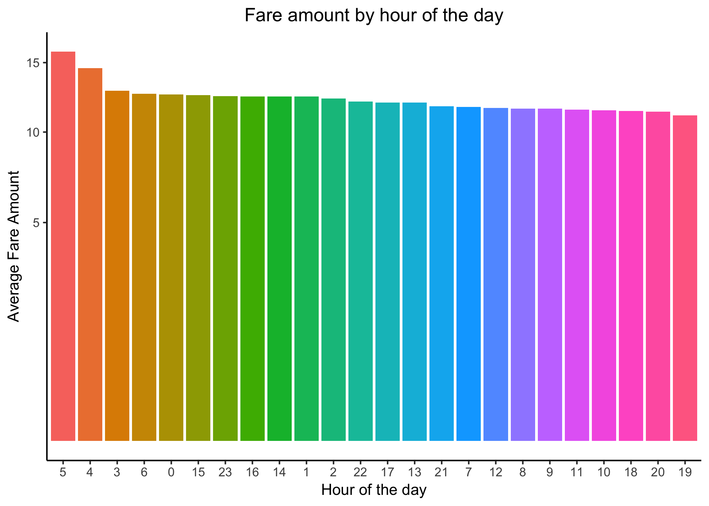

Early morning fare averages are high peaking at
5am.

``` r
plot_hourly_trip_duration <- trip_combined_sample[, .(mean_hourly_trip_duration = mean(trip_time_in_secs)), by = list(pickup_hour)]

ggplot(plot_hourly_trip_duration, aes(reorder(pickup_hour, -mean_hourly_trip_duration), mean_hourly_trip_duration, fill = reorder(pickup_hour, -mean_hourly_trip_duration))) +
  geom_col() +
  scale_y_sqrt() +
  labs(x = "Hour of the day", y = "Average Trip Duration") +
  ggtitle("Trip Duration by hour of the day") +
  theme(panel.background = element_blank(), 
        axis.line = element_line(colour = "black"), 
        plot.title = element_text(hjust = 0.5)) +
  theme(legend.position = "none")
```

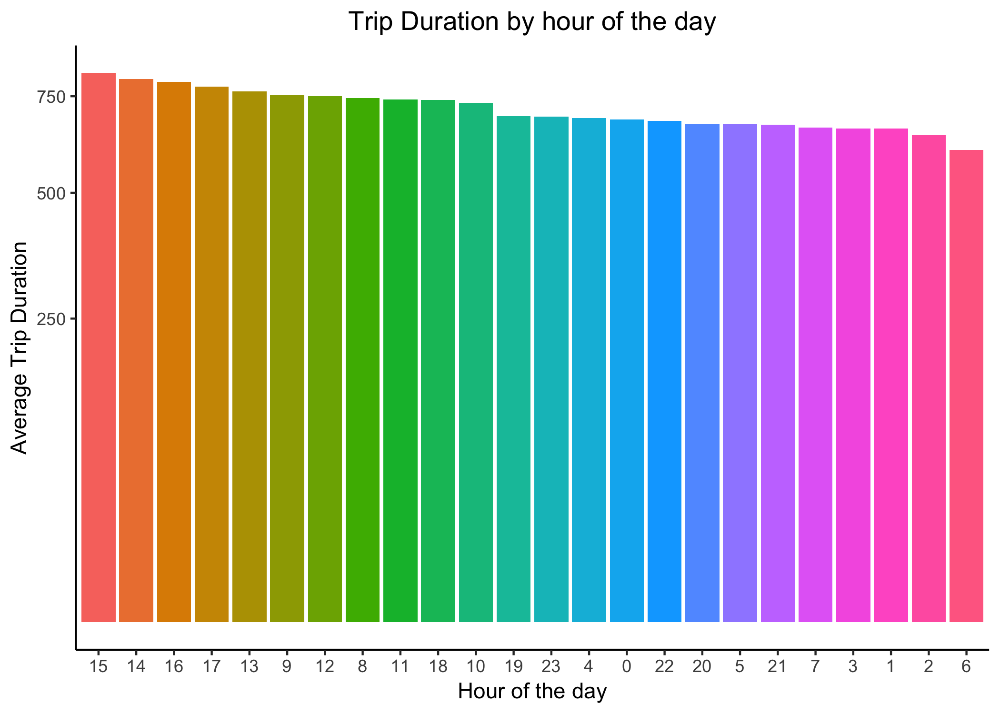

Trip in the afternoons till evenings are longer duration trips, probably
because of traffic.

## Pickup distance from NYC centre

To see which at the busiest locations for taxi pickup and the impact of
location on fare amount, let us compute a feature/variable which depicts
the distance from city center. The hypothesis is that the locations
closer to city center will be the busiest.

``` r
# New York City coordinates
nyc = c(-74.0063889, 40.7141667)

# Calculate distance from the city
trip_combined_sample$pickup_dist_from_city <- distm(trip_combined_sample[,list(pickup_longitude, pickup_latitude)], nyc, fun = distHaversine)
```

Converting distance in meters to kilometers

``` r
# Convert distance to km
trip_combined_sample[, pickup_dist_from_city := round(pickup_dist_from_city/1000, 2)]

summary(trip_combined_sample$pickup_dist_from_city)
```

    ##     Min.  1st Qu.   Median     Mean  3rd Qu.     Max. 
    ##    0.000    3.070    4.990    5.407    6.970 1210.840

The summary shows the maximum distance of a pickup from city center is
1200 km and is consistent with the ~1000km radius we applied to the
sample dataset based on lat and long degrees. 75% of the pickups are
within 7km from city
centre.

``` r
trip_combined_sample[, km_bin := cut(trip_combined_sample$pickup_dist_from_city, 
                                     seq(0, max(pickup_dist_from_city) + 2, by = 2),  
                                     include.lowest = TRUE, 
                                     right = FALSE)]

plot_distance_from_city <- trip_combined_sample[pickup_dist_from_city <=30, .N, by = list(km_bin)]

ggplot(plot_distance_from_city, aes(reorder(km_bin, -N), N, fill = reorder(km_bin, -N))) +
  geom_col() +
  scale_y_sqrt() +
  labs(x = "Distance from city (km) 2 km bins", y = "Number of pickups") +
  ggtitle("Number of pickups by distance from city") +
  theme(panel.background = element_blank(), 
        axis.line = element_line(colour = "black"), 
        plot.title = element_text(hjust = 0.5)) +
  theme(legend.position = "none")
```

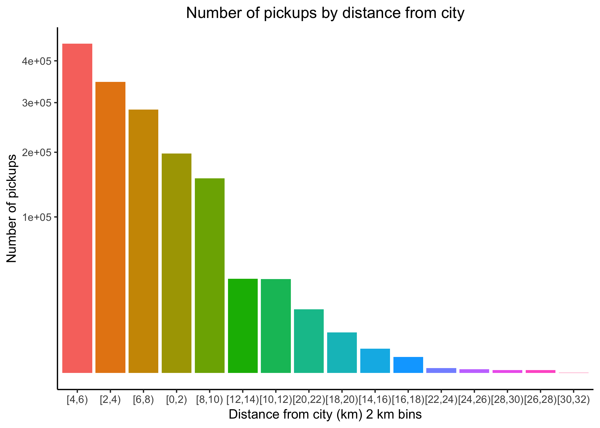

The above chart shows top ten locations (in terms of radial distance
from NYC center). The top 5 busiest locations are within 10km radius of
the New York city center.

## Trip with highest Standard Deviation

The 100% of the trip duration ranges from min to max (1, 10800) secs.
The 99.7% of the trip duration range as per 3 standard deviation are
(-895.3775, 2397.632). The sample dataset does not have any negative
values and is positively right skewed. Hence, the trip with max trip
duration of 10800 secs is the trip with the highest standard
deviation

``` r
trip_combined_sample[ , .(min = min(trip_time_in_secs), max = max(trip_time_in_secs))]
```

    ##    min  max
    ## 1:   1 9960

``` r
trip_combined_sample[ , .(lower_bound = mean(trip_time_in_secs) - 3*sd(trip_time_in_secs), upper_bound = mean(trip_time_in_secs) + 3*sd(trip_time_in_secs))]
```

    ##    lower_bound upper_bound
    ## 1:   -832.5237    2275.949

``` r
ggplot(trip_combined_sample, aes(trip_time_in_secs, fill = "red", colour = 'red')) +
  geom_density(adjust = 5, alpha = 0.2) +
  labs(x = "Trip Duration (in secs)", y = "Density") +
  ggtitle("Density plot of Trip Duration") +
  theme(panel.background = element_blank(), 
        axis.line = element_line(colour = "black"), 
        plot.title = element_text(hjust = 0.5)) +
  theme(legend.position = "none")
```

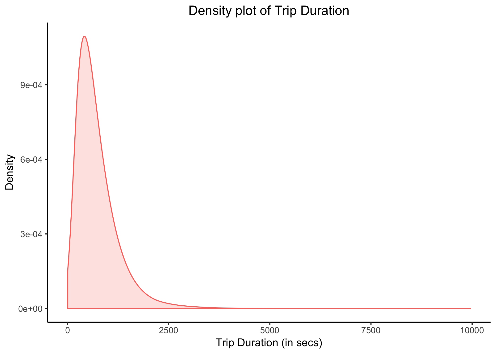

## Standard Deviation of Fare Amount

Trip with the most consistent fare amount is the one with the least
standard deviation which implies the trip with the fare amount closest
to the mean fare
amount.

``` r
trip_combined_sample[trip_combined_sample[, which.min(abs(fare_amount - mean(fare_amount)))]]
```

    ##                           medallion                     hack_license vendor_id
    ## 1: 00005007A9F30E289E760362F69E4EAD 39C3E34B3E338A7210C1D3163E6E9589       CMT
    ##        pickup_datetime payment_type fare_amount surcharge mta_tax tip_amount
    ## 1: 2013-03-14 15:38:53          CRD          12         0     0.5       3.12
    ##    tolls_amount total_amount rate_code store_and_fwd_flag    dropoff_datetime
    ## 1:            0        15.62         1                  N 2013-03-14 15:57:28
    ##    passenger_count trip_time_in_secs trip_distance pickup_longitude
    ## 1:               1              1114           1.1        -73.98238
    ##    pickup_latitude dropoff_longitude dropoff_latitude sample_flg fare_per_dist
    ## 1:        40.76354          -73.9808         40.75293       TRUE      10.90909
    ##    pickup_wday pickup_hour pickup_dist_from_city km_bin
    ## 1:         Thu          15                  5.86  [4,6)

# Multi-collinearity Analysis

Looking at the chart below, the fare amount has a fairly high linear
relationship with trip distance and trip duration which is actually true
as fare amount is directly proportional to the distance travelled and
time taken by the trip.

``` r
trip_combined_sample_cormat <- trip_combined_sample[, 
                                                  list(rate_code,
                                                   pickup_datetime = as.numeric(pickup_datetime), 
                                                   dropoff_datetime = as.numeric(dropoff_datetime),
                                                   passenger_count, trip_time_in_secs, trip_distance, 
                                                   pickup_longitude, pickup_latitude, 
                                                   dropoff_longitude, dropoff_latitude, 
                                                   pickup_wday = as.numeric(trip_combined_sample$pickup_wday),
                                                   pickup_hour, pickup_dist_from_city, fare_amount)]


corr <- cor(trip_combined_sample_cormat, use = "pairwise.complete.obs")


ggcorrplot(corr, hc.order = FALSE, type = "lower",
           ggtheme = ggthemes::theme_gdocs,
           colors = c("#ff7f0e", "white", "#1f83b4"),
           lab = TRUE) +
            ggtitle("Correlation Matrix") +
            theme(panel.grid.major=element_blank(),
                  plot.title = element_text(hjust = 0.5)) 
```

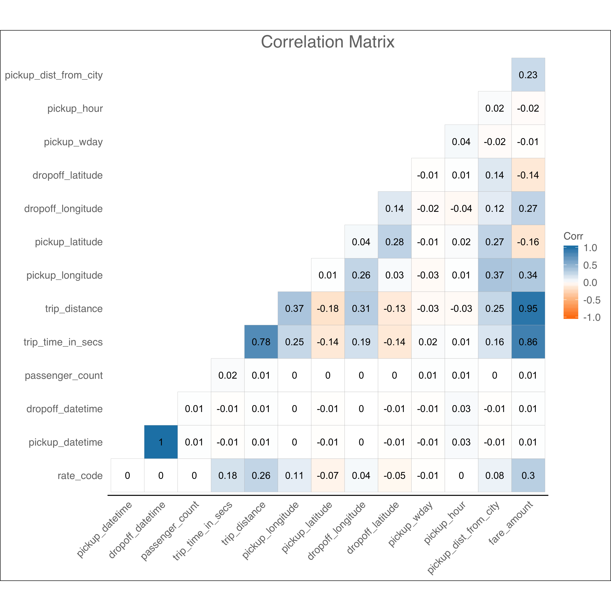

# Linear Regression

Let’s try to build a model for predicting the fare amount based on all
the continous variables as shown in the above chart and also try to
build a model using just the highly correlated independent variables
*trip\_distance* and *trip\_time\_in\_secs*

## Split data into train and test datasets

We will use 80% of the sample data to train the model and 20% of the
data to test the model performance.

``` r
# Setting seed for reproducible results
set.seed(131)
training_samples <- createDataPartition(trip_combined_sample_cormat$fare_amount, p = 0.8, list = FALSE)
train_data  <- trip_combined_sample_cormat[training_samples, ]
test_data <- trip_combined_sample_cormat[-training_samples, ]
```

## Train a multiple linear regression model

For the first model, we will use all the continous variables

``` r
# Train the model
model_1<-lm(fare_amount~., data = train_data)
model_summary <- summary(model_1)
model_summary
```

    ## 
    ## Call:
    ## lm(formula = fare_amount ~ ., data = train_data)
    ## 
    ## Residuals:
    ##     Min      1Q  Median      3Q     Max 
    ## -442.84   -0.33   -0.07    0.20  163.13 
    ## 
    ## Coefficients:
    ##                         Estimate Std. Error  t value Pr(>|t|)    
    ## (Intercept)           -5.040e+01  7.646e+00   -6.591 4.36e-11 ***
    ## rate_code              2.116e+00  6.155e-03  343.867  < 2e-16 ***
    ## pickup_datetime       -7.372e-05  1.506e-05   -4.894 9.88e-07 ***
    ## dropoff_datetime       7.374e-05  1.506e-05    4.895 9.81e-07 ***
    ## passenger_count       -1.940e-02  1.481e-03  -13.097  < 2e-16 ***
    ## trip_time_in_secs      5.796e-03  1.636e-05  354.399  < 2e-16 ***
    ## trip_distance          1.916e+00  1.123e-03 1705.065  < 2e-16 ***
    ## pickup_longitude       6.561e-01  5.662e-02   11.587  < 2e-16 ***
    ## pickup_latitude        8.695e-01  6.121e-02   14.205  < 2e-16 ***
    ## dropoff_longitude     -6.448e-01  5.453e-02  -11.824  < 2e-16 ***
    ## dropoff_latitude      -3.045e-01  5.402e-02   -5.637 1.74e-08 ***
    ## pickup_wday           -5.109e-04  9.912e-04   -0.515    0.606    
    ## pickup_hour           -9.014e-03  3.156e-04  -28.559  < 2e-16 ***
    ## pickup_dist_from_city  2.100e-03  4.928e-04    4.262 2.03e-05 ***
    ## ---
    ## Signif. codes:  0 '***' 0.001 '**' 0.01 '*' 0.05 '.' 0.1 ' ' 1
    ## 
    ## Residual standard error: 2.271 on 1224935 degrees of freedom
    ## Multiple R-squared:  0.9421, Adjusted R-squared:  0.9421 
    ## F-statistic: 1.533e+06 on 13 and 1224935 DF,  p-value: < 2.2e-16

The model summary tells us that all the independent variables are
significant in predicting the final value of the dependent variable
(fare amount). An R-squared of 94.37% is a pretty good measure of the
model performance. We need to ensure we are not overfitting the model
and there are no effects of multi-collinearity among the independent
variables that can impact the model performance.

## Testing the model performance

We will use root mean square error (RMSE) and R-squared (R2) to measure
and test the model performance.

RMSE is the mean error on the predictions and tell us how far the
predicted value is from actual. For this metric, the lower the error,
the better is the model perfomance.

R2 is the measure of proportion of the variability in the data that can
be explained by the variations in the independent variables. Ideally,
100% of the variation in the dependent variable must be explained by the
variations in the independent variables. So, for this metric, the higher
values suggests a better performing model.

``` r
# Make predictions
predictions <-  predict(model_1, test_data)
# Model performance
data.table(
  RMSE = RMSE(predictions, test_data$fare_amount),
  R2 = R2(predictions, test_data$fare_amount)
)
```

    ##        RMSE        R2
    ## 1: 2.411707 0.9352333

To detect multicollinearity in a regression model, will test the
Variance Inflation Factor (VIF) of each of the independent variables.
The cut-off of VIF = 5 is used to determine the magnitude of
multicollinearity and the variables that have VIF\>5 are generally
removed from the regression
    model.

``` r
vif(model_1)
```

    ##             rate_code       pickup_datetime      dropoff_datetime 
    ##          1.085621e+00          3.214340e+07          3.214314e+07 
    ##       passenger_count     trip_time_in_secs         trip_distance 
    ##          1.000618e+00          1.701438e+01          3.305365e+00 
    ##      pickup_longitude       pickup_latitude     dropoff_longitude 
    ##          1.410441e+00          1.196281e+00          1.196667e+00 
    ##      dropoff_latitude           pickup_wday           pickup_hour 
    ##          1.135312e+00          1.006898e+00          1.009896e+00 
    ## pickup_dist_from_city 
    ##          1.379146e+00

The VIF for two of the independent variables is quite high.
*pickup\_datetime* and *dropoff\_datetime*  
Let’s remove these variable and try the regression model.

``` r
# Train the model
model_2<-lm(fare_amount~. -pickup_datetime-dropoff_datetime, data = train_data)
model_summary <- summary(model_2)
model_summary
```

    ## 
    ## Call:
    ## lm(formula = fare_amount ~ . - pickup_datetime - dropoff_datetime, 
    ##     data = train_data)
    ## 
    ## Residuals:
    ##     Min      1Q  Median      3Q     Max 
    ## -442.79   -0.33   -0.07    0.20  163.12 
    ## 
    ## Coefficients:
    ##                         Estimate Std. Error  t value Pr(>|t|)    
    ## (Intercept)           -2.205e+01  6.738e+00   -3.273  0.00106 ** 
    ## rate_code              2.116e+00  6.155e-03  343.836  < 2e-16 ***
    ## passenger_count       -1.930e-02  1.481e-03  -13.032  < 2e-16 ***
    ## trip_time_in_secs      5.869e-03  6.466e-06  907.613  < 2e-16 ***
    ## trip_distance          1.916e+00  1.123e-03 1705.799  < 2e-16 ***
    ## pickup_longitude       6.542e-01  5.662e-02   11.554  < 2e-16 ***
    ## pickup_latitude        8.669e-01  6.121e-02   14.162  < 2e-16 ***
    ## dropoff_longitude     -6.463e-01  5.453e-02  -11.852  < 2e-16 ***
    ## dropoff_latitude      -3.064e-01  5.402e-02   -5.672 1.42e-08 ***
    ## pickup_wday           -6.830e-04  9.910e-04   -0.689  0.49069    
    ## pickup_hour           -8.975e-03  3.155e-04  -28.450  < 2e-16 ***
    ## pickup_dist_from_city  2.065e-03  4.928e-04    4.190 2.79e-05 ***
    ## ---
    ## Signif. codes:  0 '***' 0.001 '**' 0.01 '*' 0.05 '.' 0.1 ' ' 1
    ## 
    ## Residual standard error: 2.272 on 1224937 degrees of freedom
    ## Multiple R-squared:  0.9421, Adjusted R-squared:  0.9421 
    ## F-statistic: 1.812e+06 on 11 and 1224937 DF,  p-value: < 2.2e-16

``` r
# Make predictions
predictions <-  predict(model_2, test_data)
# Model performance
data.table(
  RMSE = RMSE(predictions, test_data$fare_amount),
  R2 = R2(predictions, test_data$fare_amount)
)
```

    ##        RMSE       R2
    ## 1: 2.411694 0.935234

``` r
vif(model_2)
```

    ##             rate_code       passenger_count     trip_time_in_secs 
    ##              1.085616              1.000542              2.659152 
    ##         trip_distance      pickup_longitude       pickup_latitude 
    ##              3.303181              1.410422              1.196253 
    ##     dropoff_longitude      dropoff_latitude           pickup_wday 
    ##              1.196648              1.135295              1.006494 
    ##           pickup_hour pickup_dist_from_city 
    ##              1.008834              1.379057

Both the RMSE and R2 gets better by removing the two high VIF variables,
but the change in model performance is not that significant. The VIF of
*model\_2* improves. Hence, the *model\_2* is better than *model\_1*

Let’s also look at predicting the fare amount solely based on trip
distance and trip duration and see if the model performance improves or
declines.

``` r
# Train the model
model_3<-lm(fare_amount~trip_distance+trip_time_in_secs, data = train_data)
model_summary <- summary(model_3)
model_summary
```

    ## 
    ## Call:
    ## lm(formula = fare_amount ~ trip_distance + trip_time_in_secs, 
    ##     data = train_data)
    ## 
    ## Residuals:
    ##      Min       1Q   Median       3Q      Max 
    ## -188.784   -0.349   -0.070    0.193  165.669 
    ## 
    ## Coefficients:
    ##                    Estimate Std. Error t value Pr(>|t|)    
    ## (Intercept)       2.101e+00  3.774e-03   556.7   <2e-16 ***
    ## trip_distance     1.990e+00  1.043e-03  1908.5   <2e-16 ***
    ## trip_time_in_secs 5.756e-03  6.692e-06   860.2   <2e-16 ***
    ## ---
    ## Signif. codes:  0 '***' 0.001 '**' 0.01 '*' 0.05 '.' 0.1 ' ' 1
    ## 
    ## Residual standard error: 2.381 on 1224946 degrees of freedom
    ## Multiple R-squared:  0.9364, Adjusted R-squared:  0.9364 
    ## F-statistic: 9.018e+06 on 2 and 1224946 DF,  p-value: < 2.2e-16

``` r
# Make predictions
predictions <-  predict(model_3, test_data)

# Model performance
data.table(
  RMSE = RMSE(predictions, test_data$fare_amount),
  R2 = R2(predictions, test_data$fare_amount)
)
```

    ##        RMSE        R2
    ## 1: 2.456246 0.9328061

``` r
vif(model_3)
```

    ##     trip_distance trip_time_in_secs 
    ##           2.59301           2.59301

The RMSE increases and R-squared decreases for the third model with just
two independent variables, which makes the *model\_2* as the best model
so far.

# Machine Learning

## xgboost model

Next we try to fit a machine learning model to our data and see if we
can get a better performing model. We are going to try Extreme gradient
boosting (xgboot) model for our regression problem. Here we are fitting
a xgboost model with randomly chosen hyperparameters using the same
training dataset that we used earlier in the linear model and test the
model performance using the same metrics and same test dataset that we
have used
earlier.

``` r
xg_train <- xgb.DMatrix(data.matrix(train_data[, names(train_data)[1:12],with=FALSE])
                        , label = train_data$fare_amount
                        , missing = NaN
                        )

xg_test <- xgb.DMatrix(data.matrix(test_data[, names(test_data)[1:12],with=FALSE])
                       , label = test_data$fare_amount
                       , missing = NaN
                      )


# Hyperparameter has been randomly chosen but can be tuned using a gridsearch method
model_4 <- xgboost(data = xg_train, # training data as matrix
                          label = train_data$fare_amount,  # column of outcomes
                          nrounds = 100,       # number of trees to build
                          objective = 'reg:squarederror', # objective
                          eta = 0.3,
                          depth = 6,
                          verbose = 0  # silent
)

# Make predictions
pred <- predict(model_4, xg_test)

data.table(
  RMSE = RMSE(pred, test_data$fare_amount),
  R2 = R2(pred, test_data$fare_amount)
)
```

    ##        RMSE        R2
    ## 1: 1.114159 0.9861759

We can see that the machine learning model performs much better than
linear regression with a lower RMSE and better R-squared

``` r
xgb.importance(names(train_data)[1:12], model = model_4)
```

    ##               Feature         Gain       Cover   Frequency
    ##  1:     trip_distance 8.579110e-01 0.336545247 0.201131999
    ##  2: trip_time_in_secs 9.810436e-02 0.208954398 0.208611280
    ##  3:         rate_code 3.568263e-02 0.098816181 0.135435618
    ##  4: dropoff_longitude 3.321075e-03 0.142506303 0.106731352
    ##  5:  dropoff_latitude 1.877586e-03 0.079409242 0.082474227
    ##  6:  pickup_longitude 1.544009e-03 0.036183114 0.073984233
    ##  7:   pickup_latitude 5.800135e-04 0.028651825 0.053972104
    ##  8:   pickup_datetime 4.599046e-04 0.010846980 0.071154235
    ##  9:       pickup_hour 3.364528e-04 0.025978723 0.035172832
    ## 10:       pickup_wday 9.481826e-05 0.013578814 0.014756418
    ## 11:   passenger_count 4.520735e-05 0.006634207 0.011724277
    ## 12:  dropoff_datetime 4.292596e-05 0.011894966 0.004851425

The feature importance shows the top two features are *trip\_distance*
and *trip\_time\_in\_secs*

# Mean values as central tendency

We have already established that our data has outliers and the
distribution of fare amount and trip duration is positively right
skewed. Since the distribution is not normal, the respective means for
fare amount and trip duration cannot be treated as a measure of central
tendency unless we try to make the distribution normal by removing the
outliers or by transforming the variables (fare and distance).

# Maximize earnings in a day

Assuming an 8-hour shift, let’s see which starting hour of the shift in
a day gives maximun
earnings

``` r
sum_earnings_hr <- trip_combined_sample[, .(fare_amount_sum = sum(fare_amount)), by = list(pickup_hour)][order(pickup_hour)]

# Append first 7 hours earnings at the end to handle the corner cases of rolling sum
sum_earnings_hr <- rbind(sum_earnings_hr, head(sum_earnings_hr, 7))

sum_earnings_hr[, shift_earnings := frollsum(fare_amount_sum, n = 8, align = 'left')]

# Drop the records that were appended for handling corner cases
sum_earnings_hr <- sum_earnings_hr[!is.na(shift_earnings)]

ggplot(sum_earnings_hr, aes(reorder(pickup_hour, -shift_earnings), shift_earnings, fill = reorder(pickup_hour, -shift_earnings))) +
  geom_col() +
  scale_y_sqrt() +
  labs(x = "Hour of the day", y = "Total earnings") +
  ggtitle("Total earnings for 8 hour shift by starting hour ") +
  theme(panel.background = element_blank(), 
        axis.line = element_line(colour = "black"), 
        plot.title = element_text(hjust = 0.5)) +
  theme(legend.position = "none")
```

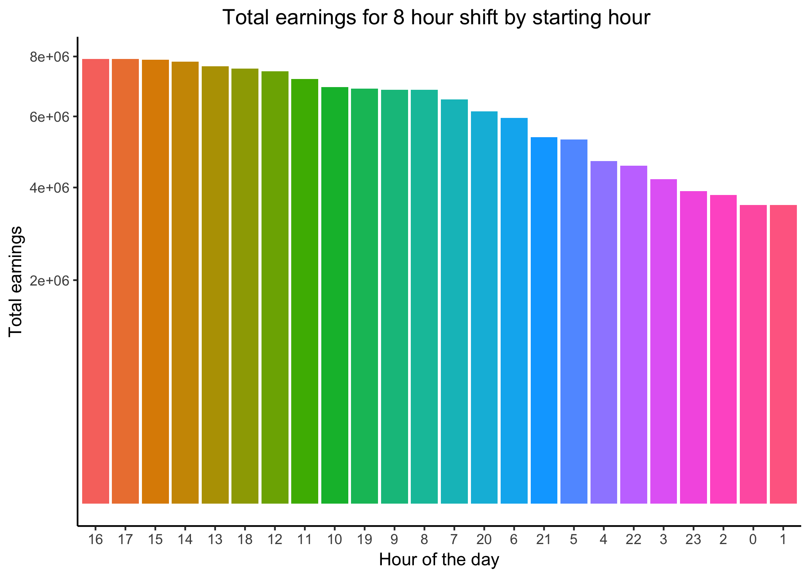

From the chart, it is clear that to maximise the earnings, it is better
to start the 8-hour shift from 4pm (evenings)

# Minimize work time in a day

Here the assumption is that work time is calculated by the time spent
working on trips (trip durations).  
Again assuming an 8-hour shift, let’s see which starting hour of the
shift in a day gives more than average earnings by spending least amount
of trip
hours

``` r
sum_earnings_trips_hr <- trip_combined_sample[, .(fare_amount_sum = sum(fare_amount), trip_time_sum = sum(trip_time_in_secs)), by = list(pickup_hour)][order(pickup_hour)]

# Append first 7 hours earnings at the end to handle the corner cases of rolling sum
sum_earnings_trips_hr <- rbind(sum_earnings_trips_hr, head(sum_earnings_trips_hr, 7))

sum_earnings_trips_hr[, fare_amount_sum_shift := frollmean(fare_amount_sum, n = 8, align = 'left')]
sum_earnings_trips_hr[, trip_time_sum_shift := frollmean(trip_time_sum, n = 8, align = 'left')]

# Drop the records that were appended for handling corner cases
sum_earnings_trips_hr <- sum_earnings_trips_hr[!is.na(fare_amount_sum_shift)]

ggplot(sum_earnings_trips_hr[fare_amount_sum_shift>=mean(fare_amount_sum_shift)], 
       aes(reorder(pickup_hour, trip_time_sum_shift), trip_time_sum_shift, fill = reorder(pickup_hour, trip_time_sum_shift))) +
  geom_col() +
  scale_y_sqrt() +
  labs(x = "Hour of the day", y = "Total trip durations") +
  ggtitle("Total trip durations for 8 hour shift by starting hour") +
  theme(panel.background = element_blank(), 
        axis.line = element_line(colour = "black"), 
        plot.title = element_text(hjust = 0.5)) +
  theme(legend.position = "none")
```

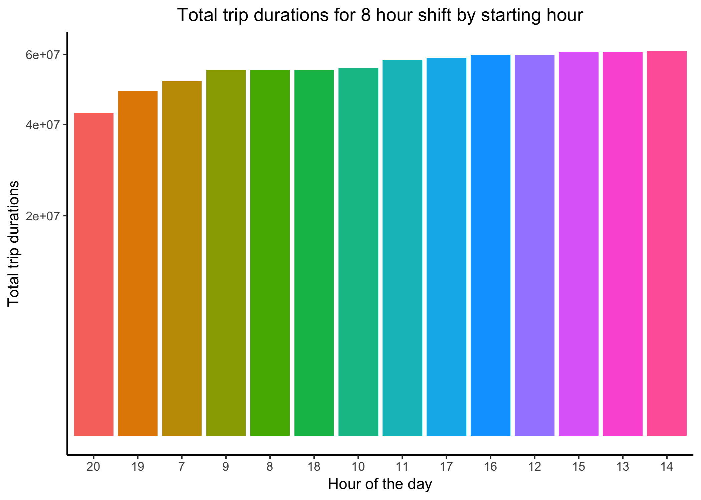

The chart shows if we start the 8-hour shift from 7pm (evenings), we
will be spent the least time on taxi trips while still maintaining
average earnings.

# Maximising 10 taxis fleet

Based on the given data:

  - Assuming a percentage share in the fare, target the pickups in the
    evenings after 4pm
  - Considering the expenses on repair/replace of taxis, target shorter
    trips (time/distance) while still maintaing average fare income
  - Not considering the competiton, the target location would be within
    10kms radius from NYC center
  - Newer taxis could be targetted for longer trip hotspots while older
    ones can be targetted for shorter trips
  - More complex analysis can be done the taxi ideal time/location
    compared to the demand time/location and redirecting taxis based on
    an optimisation algorithm
